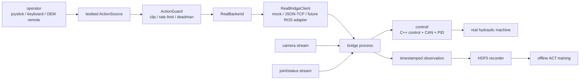

# Excavator Real Stack

真实挖机模仿学习、数据采集、底层控制和桥接进程的一体化仓库。

当前状态日期：2026-05-10。

这个仓库把之前两个代码库合并成一个面向真机部署的 monorepo：

```text
Excavator_real_stack/
  control/   C++ 底层控制库，负责 CAN、PID、机器状态、安全和液压/电机映射
  testbed/   Python 侧 testbed，负责遥操作、RealBackend、HDF5、ACT、QC
  bridge/    C++ JSON/TCP bridge 进程，连接 testbed 和 control
  configs/   真机全栈配置，轴向、限幅、CAN、ROS topic、时间同步等
  scripts/   上机检查、部署和 smoke test 脚本
  docs/      真机联调 checklist 和系统说明
```

## 系统边界

合并成一个仓库后，代码会一起部署和联调，但内部边界仍然要保持清楚：

- `testbed/` 不直接碰 CAN，不直接控制液压阀。它负责数据闭环、策略训练、记录格式、动作安全过滤和统一 backend 接口。
- `control/` 不关心 ACT、HDF5、数据集训练。它负责把底层命令变成真实机器控制，并维护硬件状态和安全逻辑。
- `bridge/` 是连接层。它负责接收 testbed 命令，调用 control 库或后续 ROS/CAN 节点，并把状态、图像时间戳、ack/fault 返回给 testbed。

推荐数据流：



## 当前已完成

### 仓库与架构

- 已创建新仓库 `Excavator_real_stack`，并推送到 GitHub。
- 已导入 `excavator_testbed` 的 realworld 分支到 `testbed/`。
- 已导入底层控制库 `excavator` 到 `control/`。
- 已新增顶层 `bridge/`、`configs/`、`scripts/`、`docs/` 目录，作为真机部署和联调入口。
- 已新增 `bridge/excavator_real_bridge` C++ JSON/TCP bridge v1，默认仿真且禁用真实 CAN。
- 两个源仓库没有被破坏，仍保持干净状态。

来源快照：

```text
testbed/  <- excavator_testbed, branch tx/v1-baseline-realworld, commit 2709f2f
control/  <- excavator, branch main, commit 1ab8eba
```

### testbed 侧

- 已移除旧 AGX、Unity、MuJoCo 和仿真闭环内容，这个分支按 real-only 处理。
- 已保留统一 backend API，并新增/强化：
  - `RealExcavatorBackend`
  - `LowLevelController`
  - `RealStateReader`
  - `RealBridgeClient`
  - `bridge_mock`
  - `bridge_tcp`
  - 本地 JSON/TCP mock bridge server
- 已定义真机第一阶段动作契约：

```text
testbed action = [swing, boom, stick, bucket]
action range   = normalized [-1, 1]
lower command  = [swing, boom, stick, bucket, left_track, right_track, boom_offset, chassis_dozer]
```

- 已实现 4D action 到底层 8D `SpeedScalarCmd` 的映射，后 4 维在第一阶段固定工位场景中置零。
- 已实现无 ROS、无 CAN、无硬件环境下的 mock/noop/bridge_mock 开发路径。
- 已实现 observation 时间戳字段：
  - `action_sample_timestamp_ns`
  - `action_send_timestamp_ns`
  - `joint_timestamp_ns`
  - `image_timestamp_ns`
  - `sync_timestamp_ns`
  - `sync_max_skew_ns`
  - `sync_warnings`
- 已新增 `SynchronizedObservationBuilder` 和 `TimestampedBuffer`，用于无 ROS 环境下测试关节数据和视觉数据的时间对齐逻辑。
- 已新增 OEM 遥控器输入边界 `OemRemoteActionSource`，当前是 import-safe adapter/stub，后续需要接厂家遥控器真实数据源。
- 已更新 HDF5 记录字段，包含 raw action、guarded action、controller ack/fault、时间戳、同步偏差等诊断信息。
- 已更新 README、配置文档、realworld plan 和 bring-up checklist。

### control 侧

- 已把底层控制库整体导入 `control/`。
- 当前已有基础能力包括：
  - C++ `excavator_api`
  - `SpeedScalarCmd`
  - control mode
  - PID/control 逻辑
  - CAN 相关代码
  - 状态结构和 status bits
  - TCP demo client/server 形态
  - `joint_pid.yaml`
- 目前没有修改 `control/` 的核心逻辑，只是作为新 monorepo 的底层控制基础引入。

### bridge 侧

- 已新增最小 C++ `excavator_real_bridge` 进程：
  - 支持现有 `bridge_tcp` JSON-line protocol v1。
  - 支持 `send_action`、`read_state`、`reset`、`close`、`shutdown`。
  - 将 4D `[swing, boom, stick, bucket]` 映射到 8D `SpeedScalarCmd`。
  - 默认 `ClosedLoopVelocityScalar`、`can_simulation=true`、`imu_simulation=true`、`can_bus_enabled=false`。
  - 带 heartbeat watchdog，超时强制下发零命令。
  - `read_state` 返回 control snapshot 和内置 RGB placeholder `fpv` 图像，方便 recorder/QC smoke test。

### 已验证

在当前开发环境中已验证：

```text
testbed 单元测试：22 个测试通过
git diff --check：通过
C++ bridge CMake configure/build：通过（conda Eigen）
bridge_tcp smoke test：C++ bridge + tb-record-real + tb-dataset-qc 通过
协议错误响应与 watchdog 零命令验证：通过
```

## C++ Bridge Smoke Test

推荐先用仓库自带脚本创建环境：

```bash
scripts/setup_env.sh
conda activate excavator-real-stack
```

脚本默认优先使用 conda，并根据 `environment.yml` 安装 Python、CMake、Eigen，再根据 `requirements.txt` 安装 `testbed`。如果只想用 Python venv：

```bash
scripts/setup_env.sh venv
source .venv/bin/activate
```

venv 模式只安装 Python 包；构建 C++ bridge 仍需要系统或 conda 提供 Eigen3。目标机也可以用 apt 安装 Eigen3：

```bash
sudo apt-get update
sudo apt-get install -y libeigen3-dev
```

构建 bridge：

```bash
cmake -S bridge -B bridge/build -DCMAKE_PREFIX_PATH="${CONDA_PREFIX:-}"
cmake --build bridge/build --target excavator_real_bridge
```

安全 smoke test 推荐直接跑一键脚本，默认不触碰真实 CAN：

```bash
cp .env.example .env
scripts/smoke_real_bridge.sh
```

脚本会自动构建 bridge、启动 CAN-disabled bridge、录制一个短 episode、
运行 `tb-dataset-qc --profile real`、测试协议错误响应和 watchdog 零命令，
最后关闭 bridge 并打印 dataset/QC/log 路径。

手动调试时可以直接启动 bridge：

```bash
./bridge/build/excavator_real_bridge \
  --host 127.0.0.1 \
  --port 8765 \
  --can-bus-enabled false \
  --can-simulation true \
  --imu-simulation true
```

另开终端运行：

```bash
tb-record-real \
  --config testbed/testbed/configs/teleop_real_v1.yaml \
  --backend bridge_tcp \
  --state-reader bridge_tcp \
  --bridge-host 127.0.0.1 \
  --bridge-port 8765 \
  --input zero \
  --num-episodes 1 \
  --max-steps 3
tb-dataset-qc --dataset-dir data/real_teleop_v1 --profile real
```

## 真机连接前状态

当前开发机能完成的最小闭环已经落地并验证：

- 环境一键安装：`environment.yml`、`requirements.txt`、`scripts/setup_env.sh`。
- C++ bridge 构建：`bridge/excavator_real_bridge` 链接 `control` 的 `robot_control_api`。
- 安全 smoke：`scripts/smoke_real_bridge.sh` 自动覆盖构建、录制、QC、协议错误和 watchdog。
- 只读 CAN probe 工具：`scripts/can_probe.py`，用于目标机上先抓包确认 ID/bitrate。
- 低速单轴测试客户端：`scripts/one_axis_bringup.py`，用于监督条件下逐轴确认方向和停止行为。

剩余内容必须在目标机或真机现场验证，不能靠开发机证明：

- CAN interface 名称、bitrate、权限和真实总线 ID。
- `18F021F6`、`18F022F6`、`18F023F6` 的 payload 与真机协议是否完全一致。
- `swing/boom/stick/bucket` 的物理轴顺序、正负方向、零位、限幅和状态位。
- controller ack/fault 的真实硬件语义。
- 真实 qpos/qvel/status 的单位、时间戳和稳定性。
- 真实相机低延迟链路；当前 C++ bridge 的 `fpv` 仍是 smoke-test 占位图，不能用于训练。
- OEM 遥控器读取；如果演示必须来自厂家遥控器，还需要实现遥控器 command stream。

详细现场流程见 [docs/real_machine_bringup_checklist.md](docs/real_machine_bringup_checklist.md)。

## 已讨论需求与当前决策

### 1. 是否把整个项目改成 ROS 项目

当前决策：不把整个仓库都改成 ROS 项目。

原因：

- `testbed/` 需要在无 ROS 的笔记本上做数据检查、训练、mock 测试。
- ACT、HDF5、QC、policy 训练不应该依赖 ROS import。
- ROS/CAN 只应该存在于 `bridge/` 或 `control/` 的硬件侧运行进程。

推荐形态：

```text
testbed Python process  <->  bridge process  <->  ROS/CAN/control
```

### 2. 关节数据和视觉数据必须时钟同步

需求已写入架构。

要求：

- 关节状态和图像帧必须有源头时间戳。
- 不要只用 testbed 收到数据的时间代替传感器时间。
- HDF5 中必须记录 action sample、action send、joint、image、sync 和 controller ack 时间。
- `sync_max_skew_ns` 和 `sync_warnings` 用于判断这一帧数据是否适合训练。

当前已完成 mock 层同步 builder；真实 ROS/camera 时间源还需要在 bridge 中实现。

### 3. 视频链路要尽量低延迟

需求已写入架构，但真实链路尚未实现。

后续建议：

- 控制画面采用 latest-frame 策略，避免旧帧排队。
- 视频传输不要走 JSON/TCP。
- 优先考虑 ROS image transport、GStreamer、共享内存或硬件编码流。
- 录制时保存最终对齐帧和源时间戳。

### 4. ACT 学的是人操作还是机器运动

当前第一阶段目标是：

```text
observation_t -> operator_command_t
```

也就是学习“人在看到当前视觉和状态时，会给什么操作指令”。

因此：

- 如果使用 joystick/keyboard，当前 testbed 已经能记录 operator command。
- 如果使用厂家遥控器，必须补遥控器指令读取模块。
- 如果只记录 qpos/qvel 轨迹而不记录人类 command，那么学习目标会变成机器运动轨迹，难度和语义都会不同。

### 5. 是否直接学习关节运动

可以，但不作为第一阶段首选。

直接学习关节轨迹会让模型同时承担：

- 人类意图
- 液压延迟
- 低层控制响应
- 机械惯性
- 传感器延迟

这会增加 ACT 学习难度。第一阶段更稳的方式是学习 normalized operator command，同时把 qpos/qvel 和时间戳完整记录下来。

### 6. ACT 能否学到液压缸动力学

ACT 可以学到数据中稳定、重复出现的一部分滞后和动态响应，但不应该把液压控制和安全全部交给 ACT。

当前分工：

- ACT/testbed 学上层操作策略。
- `control/` 和 `bridge/` 负责 command 到真实液压/CAN 控制的转换、安全限制、限幅、故障处理和硬件状态。

### 7. 是否已经实现“底层控制库负责把 command 变成真实液压控制”

还没有完成真实闭环验证。

当前状态：

- `control/` 有可用的底层控制基础和 CAN 代码。
- `testbed/` 已经能把 4D command 映射成底层 8D command。
- 但生产级 bridge、ROS/CAN 真接口、真机状态读取、真实液压执行验证还没有完成。

换句话说：

```text
接口和基础代码：已经有
真实机器闭环：还没有完成
```

## 现场下一步顺序

1. 在目标机运行 `scripts/setup_env.sh`，构建 `excavator_real_bridge`。
2. 保持真实 CAN 禁用，运行 `scripts/smoke_real_bridge.sh`。
3. 连接 CAN 适配器后先运行 `scripts/can_probe.py` 做只读抓包。
4. 确认 bitrate、接口名、预期 CAN ID、状态位和 bus health。
5. 在人工监督和急停就绪下启动真实 CAN bridge。
6. 用 `scripts/one_axis_bringup.py` 逐个确认 `swing/boom/stick/bucket`。
7. 接入真实相机和源时间戳，替换 placeholder `fpv`。
8. 录制第一批短 episode，立刻跑 `tb-dataset-qc --profile real` 并人工复核。
9. 数据稳定后再训练 ACT，并先做离线评估和 shadow prediction。
10. 通过安全评审后再考虑闭环 autonomous command。

## 常用命令

从 `testbed/` 目录运行 mock 录制：

```bash
tb-record-real \
  --config testbed/configs/teleop_real_v1.yaml \
  --backend bridge_mock \
  --state-reader bridge_mock \
  --input zero \
  --num-episodes 1
```

启动本地 JSON/TCP mock bridge：

```bash
tb-bridge-mock-server --port 8765
```

连接本地 mock bridge：

```bash
tb-record-real \
  --config testbed/configs/teleop_real_v1.yaml \
  --backend bridge_tcp \
  --state-reader bridge_tcp \
  --bridge-port 8765
```

从 `control/` 或 `bridge/` 编译和上机前，请先在目标机器安装 CMake、CAN 工具和 Eigen，并确认安全 checklist。

更多上机检查见：

```text
docs/real_machine_bringup_checklist.md
```
