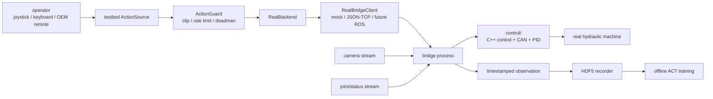

# Excavator Real Stack

真实挖机模仿学习、数据采集、底层控制和后续 ROS/CAN 桥接的一体化仓库。

当前状态日期：2026-05-10。

这个仓库把之前两个代码库合并成一个面向真机部署的 monorepo：

```text
Excavator_real_stack/
  control/   C++ 底层控制库，负责 CAN、PID、机器状态、安全和液压/电机映射
  testbed/   Python 侧 testbed，负责遥操作、RealBackend、HDF5、ACT、QC
  bridge/    后续真实 ROS/CAN bridge 进程，连接 testbed 和 control
  configs/   真机全栈配置，轴向、限幅、CAN、ROS topic、时间同步等
  scripts/   上机检查、部署和 smoke test 脚本
  docs/      真机联调 checklist 和系统说明
```

## 系统边界

合并成一个仓库后，代码会一起部署和联调，但内部边界仍然要保持清楚：

- `testbed/` 不直接碰 CAN，不直接控制液压阀。它负责数据闭环、策略训练、记录格式、动作安全过滤和统一 backend 接口。
- `control/` 不关心 ACT、HDF5、数据集训练。它负责把底层命令变成真实机器控制，并维护硬件状态和安全逻辑。
- `bridge/` 是连接层。后续真实上机时，它负责接收 testbed 命令，调用 control 库或 ROS/CAN 节点，并把状态、图像时间戳、ack/fault 返回给 testbed。

推荐数据流：



## 当前已完成

### 仓库与架构

- 已创建新仓库 `Excavator_real_stack`，并推送到 GitHub。
- 已导入 `excavator_testbed` 的 realworld 分支到 `testbed/`。
- 已导入底层控制库 `excavator` 到 `control/`。
- 已新增顶层 `bridge/`、`configs/`、`scripts/`、`docs/` 目录，作为真机部署和联调入口。
- 两个源仓库没有被破坏，仍保持干净状态。

来源快照：

```text
testbed/  <- excavator_testbed, branch tx/v1-baseline-realworld, commit 2709f2f
control/  <- excavator, branch main, commit 1ab8eba
```

### testbed 侧

- 已移除旧 AGX、Unity、MuJoCo 和仿真闭环内容，这个分支按 real-only 处理。
- 已保留统一 backend API，并新增/强化：
  - `RealExcavatorBackend`
  - `LowLevelController`
  - `RealStateReader`
  - `RealBridgeClient`
  - `bridge_mock`
  - `bridge_tcp`
  - 本地 JSON/TCP mock bridge server
- 已定义真机第一阶段动作契约：

```text
testbed action = [swing, boom, stick, bucket]
action range   = normalized [-1, 1]
lower command  = [swing, boom, stick, bucket, left_track, right_track, boom_offset, chassis_dozer]
```

- 已实现 4D action 到底层 8D `SpeedScalarCmd` 的映射，后 4 维在第一阶段固定工位场景中置零。
- 已实现无 ROS、无 CAN、无硬件环境下的 mock/noop/bridge_mock 开发路径。
- 已实现 observation 时间戳字段：
  - `action_sample_timestamp_ns`
  - `action_send_timestamp_ns`
  - `joint_timestamp_ns`
  - `image_timestamp_ns`
  - `sync_timestamp_ns`
  - `sync_max_skew_ns`
  - `sync_warnings`
- 已新增 `SynchronizedObservationBuilder` 和 `TimestampedBuffer`，用于无 ROS 环境下测试关节数据和视觉数据的时间对齐逻辑。
- 已新增 OEM 遥控器输入边界 `OemRemoteActionSource`，当前是 import-safe adapter/stub，后续需要接厂家遥控器真实数据源。
- 已更新 HDF5 记录字段，包含 raw action、guarded action、controller ack/fault、时间戳、同步偏差等诊断信息。
- 已更新 README、配置文档、realworld plan 和 bring-up checklist。

### control 侧

- 已把底层控制库整体导入 `control/`。
- 当前已有基础能力包括：
  - C++ `excavator_api`
  - `SpeedScalarCmd`
  - control mode
  - PID/control 逻辑
  - CAN 相关代码
  - 状态结构和 status bits
  - TCP demo client/server 形态
  - `joint_pid.yaml`
- 目前没有修改 `control/` 的核心逻辑，只是作为新 monorepo 的底层控制基础引入。

### 已验证

在当前 Mac 开发环境中已验证：

```text
testbed 单元测试：22 个测试通过，3 个因可选依赖缺失跳过
Python compileall：通过
git diff --check：通过
新仓库 push：通过
```

## 因环境限制尚未完成

以下内容不是设计上不需要，而是当前电脑没有对应环境或硬件，所以只完成了接口、mock、文档和静态验证。

### ROS/CAN 真 bridge 尚未实现

当前电脑没有 ROS 环境，也没有 CAN 设备和真机硬件。因此还没有实现生产级：

- ROS node
- ROS topic/service/action message
- CAN 设备打开和收发
- testbed 到 control 的真实 bridge 进程
- controller ack/fault 的真实硬件语义
- 真机状态读取和回传

当前只保留了：

- `RosCanBridgeClient` stub
- `RosCanLowLevelController` stub
- `RosCanStateReader` stub
- JSON/TCP bridge mock
- import-safe adapter 边界

### 底层控制库尚未在本机编译验证

当前 Mac 环境没有 `cmake`，也没有目标机器的 CAN/ROS 运行环境，所以 `control/` 尚未在本机完成 C++ 编译和硬件验证。

后续需要在真机或目标开发机上验证：

- CMake build
- CAN interface 名称和权限
- `setup/setup_can.sh`
- `joint_pid.yaml`
- `excavator_api_tcp_client`
- control loop start/stop
- CAN bus disabled 模式和真实 CAN 模式

### 视频低延迟链路尚未实现

JSON/TCP bridge 只适合 command/state bring-up，不适合作为最终视频传输链路。

当前尚未实现：

- 真实相机驱动接入
- 低延迟图像传输
- 硬件编码/解码
- ROS image transport 或 GStreamer 链路
- latest-frame 队列策略
- 端到端视频延迟测量

后续目标是：操作画面走低延迟链路，HDF5 只保存同步后的 RGB 帧、时间戳和诊断信息。

### 厂家遥控器读取尚未实现

如果用厂家遥控器采集人类演示，那么需要读取遥控器真实操作指令。当前只实现了接口占位，没有实现：

- 厂家遥控器协议解析
- CAN 上遥控指令截取
- 遥控器输入时间戳
- 遥控器输入与图像/关节状态同步

如果不读取遥控器输入，只记录机器运动，那么学到的是机器状态轨迹，不是严格意义上的“人看到什么然后怎么操作”。

## 已讨论需求与当前决策

### 1. 是否把整个项目改成 ROS 项目

当前决策：不把整个仓库都改成 ROS 项目。

原因：

- `testbed/` 需要在无 ROS 的笔记本上做数据检查、训练、mock 测试。
- ACT、HDF5、QC、policy 训练不应该依赖 ROS import。
- ROS/CAN 只应该存在于 `bridge/` 或 `control/` 的硬件侧运行进程。

推荐形态：

```text
testbed Python process  <->  bridge process  <->  ROS/CAN/control
```

### 2. 关节数据和视觉数据必须时钟同步

需求已写入架构。

要求：

- 关节状态和图像帧必须有源头时间戳。
- 不要只用 testbed 收到数据的时间代替传感器时间。
- HDF5 中必须记录 action sample、action send、joint、image、sync 和 controller ack 时间。
- `sync_max_skew_ns` 和 `sync_warnings` 用于判断这一帧数据是否适合训练。

当前已完成 mock 层同步 builder；真实 ROS/camera 时间源还需要在 bridge 中实现。

### 3. 视频链路要尽量低延迟

需求已写入架构，但真实链路尚未实现。

后续建议：

- 控制画面采用 latest-frame 策略，避免旧帧排队。
- 视频传输不要走 JSON/TCP。
- 优先考虑 ROS image transport、GStreamer、共享内存或硬件编码流。
- 录制时保存最终对齐帧和源时间戳。

### 4. ACT 学的是人操作还是机器运动

当前第一阶段目标是：

```text
observation_t -> operator_command_t
```

也就是学习“人在看到当前视觉和状态时，会给什么操作指令”。

因此：

- 如果使用 joystick/keyboard，当前 testbed 已经能记录 operator command。
- 如果使用厂家遥控器，必须补遥控器指令读取模块。
- 如果只记录 qpos/qvel 轨迹而不记录人类 command，那么学习目标会变成机器运动轨迹，难度和语义都会不同。

### 5. 是否直接学习关节运动

可以，但不作为第一阶段首选。

直接学习关节轨迹会让模型同时承担：

- 人类意图
- 液压延迟
- 低层控制响应
- 机械惯性
- 传感器延迟

这会增加 ACT 学习难度。第一阶段更稳的方式是学习 normalized operator command，同时把 qpos/qvel 和时间戳完整记录下来。

### 6. ACT 能否学到液压缸动力学

ACT 可以学到数据中稳定、重复出现的一部分滞后和动态响应，但不应该把液压控制和安全全部交给 ACT。

当前分工：

- ACT/testbed 学上层操作策略。
- `control/` 和未来 `bridge/` 负责 command 到真实液压/CAN 控制的转换、安全限制、限幅、故障处理和硬件状态。

### 7. 是否已经实现“底层控制库负责把 command 变成真实液压控制”

还没有完成真实闭环验证。

当前状态：

- `control/` 有可用的底层控制基础和 CAN 代码。
- `testbed/` 已经能把 4D command 映射成底层 8D command。
- 但生产级 bridge、ROS/CAN 真接口、真机状态读取、真实液压执行验证还没有完成。

换句话说：

```text
接口和基础代码：已经有
真实机器闭环：还没有完成
```

## 下一步开发顺序

1. 在 `bridge/` 中实现第一版真实 bridge 骨架。
2. 先接 JSON/TCP 或本地进程调用，跑通 command/state 结构。
3. 在目标机器上编译 `control/`。
4. 添加 CAN disabled / simulation mode 的 bridge smoke test。
5. 接真实关节状态和 status bits。
6. 接相机时间戳和低延迟视频链路。
7. 做一轴低速真机测试。
8. 录制第一批短 episode，并检查 HDF5 时间戳、同步偏差、guard/fault 诊断。
9. 做离线 ACT 训练和 shadow prediction。
10. 通过安全评审后再考虑闭环 autonomous command。

## 常用命令

从 `testbed/` 目录运行 mock 录制：

```bash
tb-record-real \
  --config testbed/configs/teleop_real_v1.yaml \
  --backend bridge_mock \
  --state-reader bridge_mock \
  --input zero \
  --num-episodes 1
```

启动本地 JSON/TCP mock bridge：

```bash
tb-bridge-mock-server --port 8765
```

连接本地 mock bridge：

```bash
tb-record-real \
  --config testbed/configs/teleop_real_v1.yaml \
  --backend bridge_tcp \
  --state-reader bridge_tcp \
  --bridge-port 8765
```

从 `control/` 目录编译和上机前，请先在目标机器安装 CMake、CAN 工具、ROS/CAN 依赖，并确认安全 checklist。

更多上机检查见：

```text
docs/real_machine_bringup_checklist.md
```
