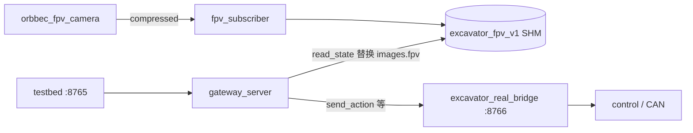

# dev_yxc 分支变更总结

**基准**：`origin/dev_yxc`
**当前分支**：`dev_yxc`
**生成日期**：2026-05-16

本文档记录 `dev_yxc` 分支引入的主要能力。部分内容最初来自推送前整理，现已按当前分支状态校正。

---

## 一、相对 `origin/dev_yxc` 总览

| 类别 | 说明 |
|------|------|
| control | 前馈/PID 与 `plan_rpm` 下发 |
| testbed | 手柄 status 链路、主从 `data_side`、真机录制入口 |
| testbed control | `RealActionPump` 固定频率重复发送最新速度命令，控制 heartbeat 与录制/观测解耦 |
| bridge | `read_state` 改为后台状态缓存读取，避免阻塞 `send_action` 请求处理 |
| ros2_bridge | Orbbec 相机解耦、FPV 共享内存、gateway 注入图像 |
| scripts/docs | 主从部署脚本、运行手册、环境说明 |

**统计**：新增 `ros2_bridge/`，并扩展 `testbed`、`bridge`、`control`、`scripts` 与部署文档。

---

## 二、已提交：`b3a1ec6` — control 闭环与前馈

**标题**：`feat: 前馈正负阈值分离、plan_rpm 下发与标量闭环低通`

### 动机

正反方向液压/摩擦不对称时，单一前馈阈值不够用；标量速度反馈噪声大，需低通；CAN 侧需明确下发 `plan_rpm`。

### 主要改动

| 文件 | 变更要点 |
|------|----------|
| `control/config/joint_pid.yaml` | `feedforward_scalar_threshold` 拆为 `pos` / `neg` |
| `control/src/excavator/excavator_control.cpp` | 位置/速度/标量闭环统一前馈斜率限制；标量闭环测量速度 5Hz 低通；`plan_rpm` 写入 CAN |
| `control/.../excavator_control.hpp` | 对应成员与接口 |
| `control/tools/plot_joint_ref_resp.py` | 绘图支持新参数 |
| `control/tools/excavator_api_tcp_client.cpp` 等 | 小幅对齐 |

### 验证建议

- 仿真 CAN：`excavator_real_bridge --can-simulation true`
- 关节阶跃/正弦：`plot_joint_ref_resp.py` 对比 ref 与反馈

---

## 三、已合入：testbed 真机遥操作与 status

### 3.1 手柄 → status 位（对齐 `excavator_api_tcp_server.py`）

| 组件 | 变更 |
|------|------|
| `testbed/actions/gamepad.py` | `button0~10` 上升沿 → `toggle_mask` bit0~10；`button11` → `group_switch`；`poll()` 返回 `toggle_mask` |
| `testbed/backends/real/contracts.py` | `STATUS_TOGGLE_BIT_COUNT`、`apply_status_toggle_mask_to_status11()` |
| `bridge.py` / `bridge_socket.py` / `bridge_server.py` | `send_status(toggle_mask)`、`apply_status_toggle_mask()` |
| `backend.py` | 录制循环每步应用 toggle |
| `control.py`（mock） | mock 支持 status |
| `cli/record_real.py` | 每步 `backend.apply_status_toggle_mask(toggle_mask)` |
| `configs/teleop_real_v1.yaml` | `reset_button: null`（避免与 status bit10 冲突） |
| `tests/test_realworld_v1.py` | status 相关单测 |

### 3.2 数据流（四轴 + status）

```text
gamepad (pygame)
  -> JoystickActionSource.poll() -> action[4], toggle_mask
  -> record_real 循环
       -> backend.apply_status_toggle_mask(toggle_mask)
       -> backend.send_action(action)
  -> bridge_tcp :8765（网关）或 :8766（直连 C++ bridge）
```

### 3.3 限制说明

- **C++ bridge 已支持 `send_status.request(toggle_mask)`**：真机联调时仍需确认 status 位与底层控制/安全逻辑的实际语义一致。
- 无相机时：testbed 可直连 `excavator_real_bridge:8765`，占位 FPV 图，已成功录制 HDF5。

---

## 四、已合入：`ros2_bridge/` — 相机与 control 解耦

**原则**：相机链路不进入 C++ control bridge；Orbbec 仅在 ROS2 侧；FPV 经 POSIX 共享内存注入 gateway 的 `read_state`。

### 4.1 架构



### 4.2 目录与职责

| 路径 | 作用 |
|------|------|
| `ros2_bridge/fpv_frame_store/` | SHM `excavator_fpv_v1`，RGB 最大 640×480 |
| `ros2_bridge/excavator_ros2_bridge/` | Orbbec launch、`fpv_image_subscriber`（C++ 可选） |
| `ros2_bridge/excavator_bridge_gateway/` | 网关 :8765、Python `fpv_subscriber_node.py`、`fpv_shm.py` |
| `ros2_bridge/README.md` | 四进程启动说明 |

### 4.3 Launch / 脚本

| 脚本 / launch | 用途 |
|---------------|------|
| `scripts/start_orbbec_fpv_camera.sh` | Orbbec 640×480 color compressed |
| `scripts/start_fpv_subscriber_py.sh` | compressed → SHM + 可选 rqt |
| `scripts/start_bridge_gateway.sh` | 对外 WebSocket :8765 |
| `scripts/start_fpv_image_subscriber.sh` | C++ 订阅备选 |
| `fpv_subscriber_with_rqt.launch.py` | republish + rqt；修复 `LaunchConfiguration` 导入、QoS、venv 下 PyQt5 |

### 4.4 已修复问题

- `fpv_shm.py`：`struct.pack_into` 格式
- `fpv_subscriber_node.py`：rclpy 日志 f-string；`qos_profile_sensor_data`
- launch：republish `qos_overrides` BEST_EFFORT；rqt 使用 `/usr/bin/python3`
- colcon：`CMakeLists.txt` / `package.xml` 构建通过

### 4.5 推荐启动顺序（真机 + 相机 + 录制）

1. `excavator_real_bridge --port 8766 --can-bus-enabled false --can-simulation true`
2. `ros2 launch excavator_ros2_bridge orbbec_fpv_camera.launch.py`
3. `./scripts/start_fpv_subscriber_py.sh`
4. `./scripts/start_bridge_gateway.sh`
5. `tb-record-real --backend bridge_tcp --bridge-port 8765 --input joystick ...`

**testbed 必须连网关 8765**，不是 8766。

---

## 五、其它杂项

| 文件 | 变更 |
|------|------|
| `control/UPSTREAM.md` | 记录 control 子模块上游 commit |
| `README.md` | control 上游 commit 引用更新 |
| `.gitignore` | 忽略本地 `test/` 目录 |

---

## 六、文件清单（便于 code review）

### 已提交（control）

- `control/config/joint_pid.yaml`
- `control/src/excavator/excavator_control.cpp`
- `control/src/excavator/excavator_converter.cpp`
- `control/src/excavator/internal/excavator_control.hpp`
- `control/src/excavator_api/excavator_control.cpp`
- `control/tools/excavator_api_tcp_client.cpp`
- `control/tools/plot_joint_ref_resp.py`

### 已合入（testbed + 根）

- `testbed/testbed/actions/gamepad.py`
- `testbed/testbed/backends/real/*`（backend, bridge, bridge_server, bridge_socket, contracts, control）
- `testbed/testbed/cli/record_real.py`
- `testbed/testbed/configs/teleop_real_v1.yaml`
- `testbed/tests/test_realworld_v1.py`
- `.gitignore`, `README.md`, `control/UPSTREAM.md`

### 已合入（ros2_bridge + scripts）

- `ros2_bridge/**`（见仓库目录树）
- `scripts/start_orbbec_fpv_camera.sh`
- `scripts/start_fpv_subscriber_py.sh`
- `scripts/start_bridge_gateway.sh`
- `scripts/start_fpv_image_subscriber.sh`

---

## 七、后续待办

- [ ] 真机确认 `send_status` status 位到液压控制/安全逻辑的映射语义
- [ ] 真机端到端：8765 网关 + Orbbec + `tb-record-real` HDF5 含 `observations/images/fpv`
- [ ] `ros2_ws` 中 `ln -s` `excavator_ros2_bridge` 后 `colcon build`（部署文档化）

---

*本文档随本次 push 一并提交至 `dev_yxc`，便于与 `origin/dev_yxc` 对齐 review。*
