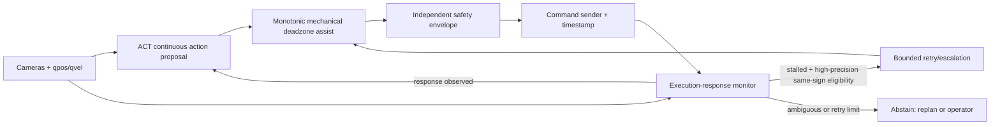

# E52 State-Hold Liveness Goal Results

Date: 2026-07-12

Status: blocked on new on-policy execution-response data and controlled field
collection authorization

### [Execution target G16: Decision]

Do not promote E52 or any H1-H5 candidate into the real command path. The best
verified current pipeline is raw ACT plus the existing mechanical deadzone
assist:

| Held-out pipeline (`episode_105..109`, 45 anchors) | Recovered | Deadlocked | Startup | Hidden by teacher forcing |
| --- | ---: | ---: | ---: | ---: |
| raw ACT | 33 / 45 | 12 / 45 | 5 / 5 | 3 |
| raw ACT + mechanical assist | **40 / 45** | **5 / 45** | **5 / 5** | **0** |
| E52 gate | 15 / 45 | 30 / 45 | 0 / 5 | 22 |
| E52 gate + mechanical assist | 35 / 45 | 10 / 45 | 5 / 5 | 5 |
| H1 + mechanical assist | 39 / 45 | 6 / 45 | 5 / 5 | 1 |
| H2 + mechanical assist | 40 / 45 | 5 / 45 | 5 / 5 | 0 |

H2 raises raw liveness to `39/45` without induced or hidden deadlocks, so its
transition objective is useful positive training evidence. It still gives no
gain over raw ACT plus assist and therefore is not a replacement candidate.
H3-H5 were rejected on train-only or old-validation gates before held-out
access.

Model output is evaluated in the direct action domain with identity scale
`[1,1,1,1]`. Joystick `action_scale` is not applied to policy output.

### [Execution target G16: Why Ordinary Offline Replay Missed the Deadlock]

Ordinary replay advances to the next recorded expert observation regardless of
whether the evaluated action would cross the machine's deadzone. A gate can
return zero while replay still supplies the image/qpos created by the expert's
successful motion. The policy then receives phase progress that its own command
could not create.

State-hold evaluation closes this specific software loop by freezing the
transition observation and qpos, setting qvel to zero, recursively carrying the
selected pipeline's final command state, and requiring the correct axis/sign to
cross the direct mechanical deadzone within 20 ticks. A parallel teacher-forced
trace identifies failures hidden by recorded state progression. The optional
full-horizon trace continues after first recovery to detect wrong/extra or
opposite motion.

This is a falsification test. It can prove that a pipeline contains an
absorbing no-motion state; without real action-response data, it cannot prove
that a deadzone-crossing command moves the excavator.

### [Execution target G16: Root Cause]

The dataset contains successful demonstrations, not the on-policy causal state
"a command was actually sent, the excavator did not respond, and the operator
retried or corrected it." With the same image/qpos/qvel, the model cannot know
whether it has not tried yet or whether actuation failed.

The experiments isolate this limit:

- H1 corrected labels but did not solve closed-loop liveness.
- H2 trained transition persistence and improved raw output, but the assist
  reference stayed at `40/45`.
- H3 hard direction projection amplified classification errors into effective
  wrong motion.
- H4 supplied a previous command without an observed response outcome; it
  learned an ambiguous phase cue and created a recursive wrong-axis attractor.
- H5's strongest wrong promotion evidence dominated the desired recovery;
  cross-head consensus had `0.70%` train precision, while the split-safe
  temporal signal abstained on every desired failure.

The next improvement is therefore data-identifiability work, not another loss
weight, deadzone, confidence, or persistence sweep.

### [Execution target G16: Recommended Execution-Aware Architecture]

Hard constraints:

- keep policy output scale at identity;
- never use a visual phase gate to suppress the first safe command;
- trigger retry only after a causally aligned command was sent and no response
  was measured over an empirically calibrated window;
- retry only the already proposed sign, within a bounded magnitude/count;
- never attenuate an already-effective safe proposal except through an
  independently verified safety veto;
- make ambiguous direction abstain; keep release, tail, and gohome ownership
  separate.

Train the ACT proposal with H2-style transition exposure, then train the
response/effect monitor on actual sent-command outcomes. Train recursive state
with on-policy aggregation, scheduled model-command histories, or DAgger-style
operator corrections. Previous commands without response labels are
insufficient.

### [Execution target G16: Required Data Slice]

For every control tick, preserve a causally aligned record of:

- raw policy action and direction probabilities;
- assist input/output, all veto/governor decisions, final sent command, send
  timestamp, and acknowledgement/suppression reason;
- source timestamps for image/qpos/qvel plus response-window qpos/qvel deltas;
- operator override, retry, and corrected axis/direction;
- reset/gap, startup, release, idle/tail, and gohome boundaries.

Collect repeated examples for every supported axis/direction of effective
response, weak-command/no-response, same-direction retry, wrong-sign
correction, multi-axis command, release, and negative idle/tail states. The
present training data contains no effective stick labels; learned stick retry
must remain disabled until dedicated evidence is collected.

### [Execution target G16: Promotion Ladder]

1. Keep raw ACT plus mechanical assist as the verified reference.
2. Collect bounded, supervised on-policy response/correction windows; do not
   change runtime defaults during collection.
3. Freeze session/terrain/operator-disjoint splits and response latency before
   tuning.
4. Require recursive and teacher-forced full-horizon state-hold, wrong/extra,
   ordinary-window, tail, and gohome gates; use the held-out set once.
5. Run `shadow_zero`, then a bounded supervised real-machine A/B. Offline pass
   remains necessary but cannot substitute for this final test.

### [Execution target G16: Durable Evidence]

- Full experiment ledger and hypothesis callbacks:
  `docs/superpowers/plans/2026-07-12-state-hold-liveness-goal.md`
- Offline evaluation protocol:
  `docs/policy_model_effect_eval_protocol.md`
- H2 artifact root:
  `/data/pingfan/Excavator_real_stack_data/usb_hdf5_qc_20260708_72_104/runs/goal_state_hold_liveness_20260712/h2_transition_state_hold_finetune_e16_200`
- H4 artifact root:
  `/data/pingfan/Excavator_real_stack_data/usb_hdf5_qc_20260708_72_104/runs/goal_state_hold_liveness_20260712/h4_causal_previous_command_h2_200`

### [Execution target G16: Final Verification]

- Repository suite: `PYTHONPATH=testbed python -m pytest -q testbed/tests` ->
  `401 passed`, `4 subtests passed`, `16` pre-existing deprecation warnings.
- Ruff over every changed/new Python source and test -> `All checks passed`.
- `git diff --check` -> passed.
- H2 best checkpoint SHA-256:
  `689961b492d8b38a9a7688663c8a2fe3ca5ac792062560aefee3e151f8495135`.
- H4 best checkpoint SHA-256:
  `c841f83c02528d3160e952181ac471fda7274d327bafd4139f0d2a23e2e6cf14`.

### [执行目标 G19：现有数据 execution-response 侧车]

无需重采即可完成第一阶段处理。对现有 `72..104` 20 Hz 数据生成了
`direct_command_qvel_response_v1` sidecar：30 个 episode、20,964 steps、
20,934 个有效 causal observations、285 个 swing/boom/bucket 有效 command
起始窗口。stick 被显式标记为任务不适用。

在 20-tick horizon 下，281 个窗口出现同向 qvel 响应；42 个窗口同时出现
反向 qvel（可能是惯性/换向残留，不能直接标为 wrong）；只有 3 个窗口既无同向
也无反向响应：`episode_82:258 boom+`、`episode_87:308 bucket-`、
`episode_98:543 boom+`。这 3 个都接近死区边界，属于待人工复核候选，不是确认的
液压失败标签。

同向响应的首次延迟摘要也已生成：boom− 中位数 1 tick、boom+ 8 ticks，
bucket− 8 ticks、bucket+ 4 ticks，swing− 4 ticks、swing+ 8 ticks。它适合做
response-window 的初始校准，不适合直接作为 retry 成功率保证。

因此现有数据可以支持 response latency/low-level effect 的第一版处理，但不能仅靠
这 3 个候选训练可靠 retry governor。没有修改源 HDF5，也没有把 joystick
`action_scale` 应用于 policy output。

侧车目录：
`/data/pingfan/Excavator_real_stack_data/usb_hdf5_qc_20260708_72_104/runs/goal_state_liveness_20260712/execution_response_existing_data_20260712`

### [Execution target G25/H2: split-safe monitor replay]

新增的 `ExecutionMonitor` 位于
`testbed/testbed/policies/execution_monitor.py`，只接收真实发送命令和
causal feedback；它不压缩 policy action、不重新实现 E52 gate，也不自动
选择 retry。`execution_monitor_eval.py` 与 CLI 使用既有 sidecar 和锁定的
19-train/5-validation split 做 response consistency replay。

报告位于：
`/data/pingfan/Excavator_real_stack_data/usb_hdf5_qc_20260708_72_104/runs/goal_state_liveness_20260712/execution_monitor_eval_g25_split_20260712/execution_monitor_eval.json`
（SHA-256 `6c46434a7fd0c29e147dff4fd71a6c0588fca2cabe855343b7a791caaf4a2a2a`）。

train 侧 180 个 onset 中 176 个 responded、4 个 stalled candidate；validation
侧 48 个全部 responded；monitor 与 sidecar 的 20-tick response label
mismatch 为 0。retry precision 明确标记为不可估计，因为现有 teleop 数据没有
policy intent、operator correction 或确认的 failed-actuation 标签。因此本轮
没有训练或选择 retry governor，也没有访问 `105..109` 或修改源 HDF5。
