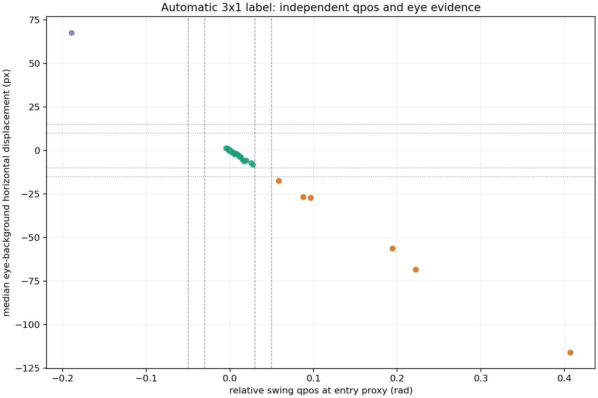

# 左/中/右实际下铲扇区自动标注 v0.1

## 可直接使用的结论

当前批次共 160 条轨迹，其中
158 条通过 swing qpos 与两路 eye 相机的三传感器一致性门槛，
可作为自动生成的 hindsight `actual_dig_sector`；其余
2 条进入审查队列，不会静默写入训练标签。

自动接收标签分布为：左 6、中 151、右 1。
分布是否均衡不影响标注流程是否成立；训练覆盖应在标注之后单独处理。

## 自动接收规则

一条记录只有同时满足以下条件，`quality.auto_usable` 才为 `true`：

1. 开始姿态属于当前 home 聚类；
2. 能检测到持续的 bucket qpos 上升；
3. 下铲代理时刻的相对 swing qpos 不在边界带；
4. video4 和 video5 的静态背景位移都能可靠配准；
5. qpos、video4、video5 给出同一个非边界 L/C/R 扇区。

任一证据缺失、落入边界或发生冲突，结果都会转为 provisional/rejected，并写入
`review_queue.jsonl`。

## 独立证据是否一致



可配对样本数为 158，相对 swing 与 eye 背景水平位移的
Pearson 相关系数为 -0.996925。负相关来自相机
坐标关系：机身向左回转时，静态背景在画面中向左移动。

自动接收的中间样本最大绝对背景位移为
8.169 px，侧向样本最小绝对位移为
17.323 px。v0.1 在两者之间保留
10–15 px 的拒绝/复核边界带。

## 文件语义

- `annotations.jsonl`：全量、版本化 sidecar；源 HDF5 不被修改；
- `review_queue.jsonl`：仅包含未自动接收的完整记录；
- `summary.json`：覆盖率、阈值、配准质量和能力边界；
- `qpos_vs_eye_displacement.png`：跨传感器一致性证据。

历史数据没有录制“要求去左/中/右”的 command，因此 command 始终保持
`unknown_not_recorded`。自动标注得到的是最终实际到达扇区，可用于 hindsight
relabeling；它不能用于证明策略遵从了一个历史上不存在的指令。

## 当前审查队列

待审查记录数：2。

```json
[
  {
    "annotation_id": "real:episode_9:actual_dig_sector_3x1:v0_1",
    "episode_id": 9,
    "status": "rejected",
    "reason_codes": [
      "initial_pose_outside_home_cluster"
    ]
  },
  {
    "annotation_id": "real:episode_140:actual_dig_sector_3x1:v0_1",
    "episode_id": 140,
    "status": "rejected",
    "reason_codes": [
      "no_sustained_bucket_rise"
    ]
  }
]
```

## 能力边界

- L/C/R 是相对开始姿态的回转扇区，不是沙箱物理宽度严格三等分；
- bucket 事件只定位明确卷收开始，不声称测得真实入土接触；
- 相机固定方式、分辨率或裁剪变化后，必须换 calibration id 并重新标定像素阈值；
- 本报告来自离线 HDF5 replay，不是真机闭环执行。
