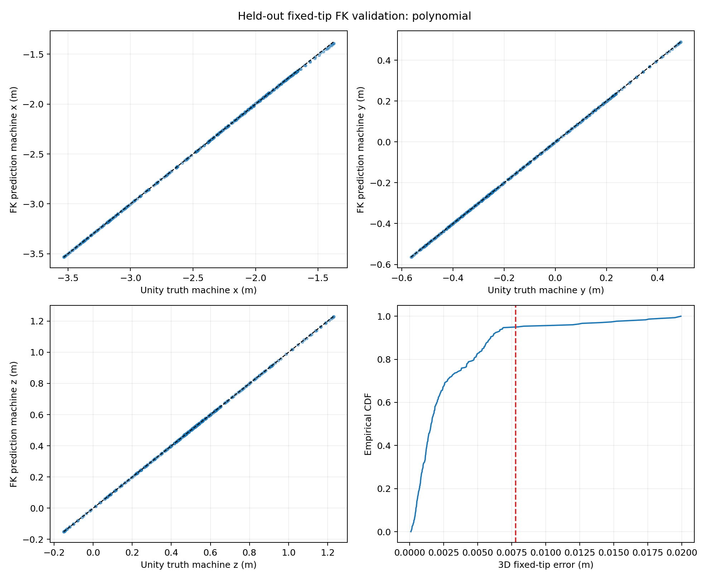
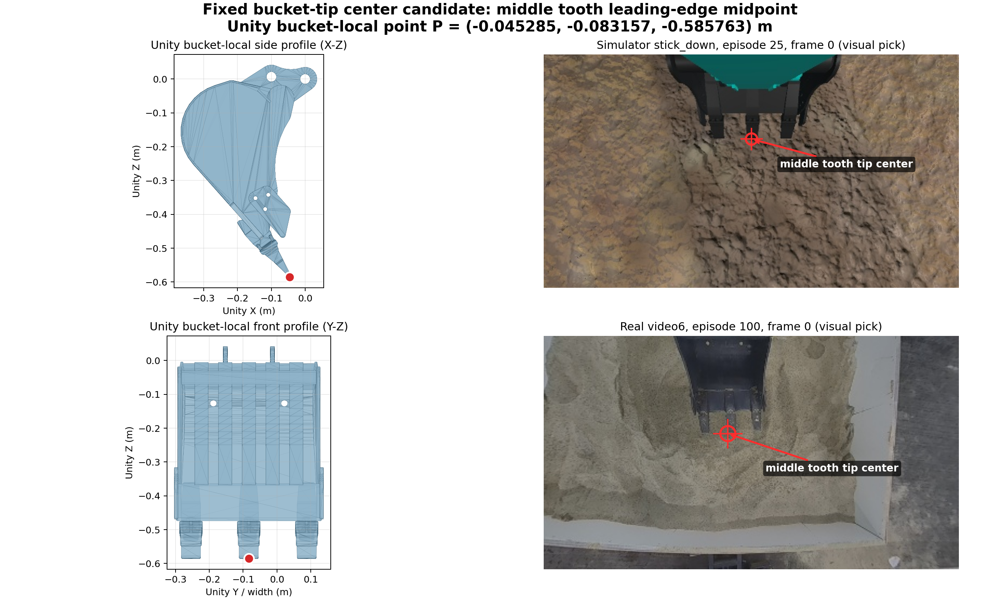
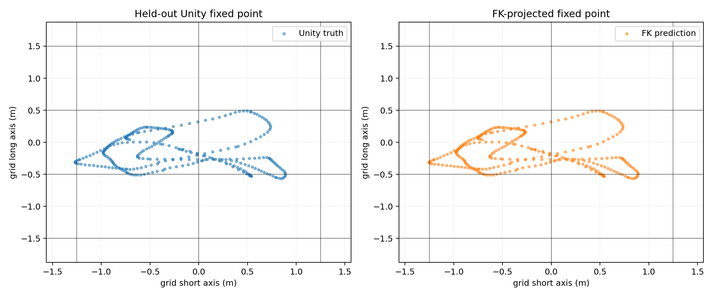
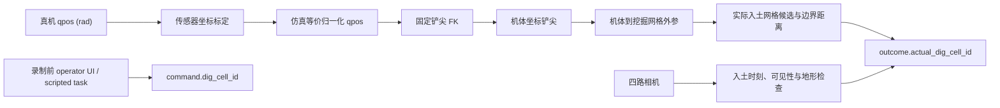

# 固定铲尖前向运动学标定报告

## 结论

四维 `qpos` 已经能够稳定映射到一个固定铲尖点。当前可交付模型是四阶多项式
经验 FK：

`归一化 qpos -> 机体坐标系中的中齿前缘中心点`

完全未参与调参和模型选型的 304 个姿态上，三维位置误差为：

| 指标 | 误差 |
| --- | ---: |
| 中位数 | 1.58 mm |
| P90 | 5.95 mm |
| P95 | 7.79 mm |
| P99 | 18.46 mm |
| 最大值 | 19.93 mm |

这足以证明：固定铲尖几何可以由 `qpos` 自动恢复，人工标注不必在每一帧重新猜测
铲尖位置。它还不能直接生成可靠的真机网格标签，因为真机传感器坐标与仿真
`qpos` 的转换、真机机体到挖掘网格的外参尚未标定。

## 固定点定义

铲尖参考点固定为 `remake5/meshes/watou.STL` 中间齿最低前缘线段的中点。它随
铲斗刚体运动，不再使用“测量框内当前最低采样点”这种会随姿态切换的代理量。

- 候选点 ID：`bucket_center_tooth_leading_edge_midpoint_v0_1`
- `bucket` 局部坐标：`(-0.04528473, -0.08315725, -0.58576298) m`
- Unity STL 导入时已经计入左右手坐标转换

固定点必须保持不变。入土遮挡只改变 `visibility` 和标注置信度，不能改用另一个
更容易看见的齿尖。

## 标定与评测口径

标定样本由当前 Unity 1:1 机构自动运动产生。历史仿真数据只提供任务相关的目标姿态
分布；每个监督标签都使用 Unity 在该步真正观测到的 `qpos`，而不是姿态复位接口的
请求值。

现有 `realign_pose` 会同时锁定受连杆约束的多个轴，请求姿态与最终姿态可能明显不同。
因此它适合回放对齐诊断，不适合作为 FK 标定真值。当前样本使用
“实际观测 `qpos` + 同一冻结时刻的固定铲尖坐标”配对。

1824 个样本按整条激励轨迹隔离：

| 用途 | 样本数 | 是否参与最终数字 |
| --- | ---: | --- |
| 基础训练 | 912 | 训练 |
| 超参数选择 | 304 | 只选每类模型的参数 |
| 模型类别选择 | 304 | 在多项式与 MLP 之间选型 |
| 最终测试 | 304 | 只报告，不参与任何选择 |

最终选择四阶多项式，而不是 MLP。它在模型类别选择轨迹上的 P95 为 22.71 mm，
低于 MLP 的 36.78 mm；在最终测试轨迹上进一步达到 7.79 mm。模型文件约 6.9 KB，
无需图像或仿真特权字段。

## 对无特权标注的帮助

这套 FK 可以成为 `goal_grid_annotation_v0_1` 的几何辅助层，但只能负责
`outcome`，不能伪造 `command`。

完成真机两项标定后，FK 可以：

1. 在人工确认的 `dig_entry` 时刻自动给出铲尖在网格中的连续坐标；
2. 自动提出 `D00` 至 `D21` 的实际入土单元候选；
3. 计算到网格边界的距离，边界附近保留多个候选而不是强制单标签；
4. 用整段 `qpos` 检查人工点击是否与机构运动连续性一致；
5. 遮挡时继续提供几何先验，再由 eye/stick 相机决定是否接受。

它不能：

- 从历史动作反推出从未记录的目标指令；
- 仅凭 `qpos` 判断第一次接触土体的时刻；
- 判断某格土是否已经挖空、下一铲应该去哪里；
- 替代相机对土面、遮挡、落点和任务上下文的判断。

因此，历史数据仍只能补 `outcome.actual_dig_cell_id`；缺失的
`command.dig_cell_id` 必须保持 `unknown_not_recorded`。未来 conditioned cycle
的数据录制仍需在动作开始前显式记录目标 token。

## 网格验证覆盖

最终测试中有 300 个固定点位于 3x2 网格内，单元分类为 300 / 300 正确。这个数字
只证明已经覆盖单元中的分类可行，不能解释为全网格已经验证。

| 数据范围 | D00 | D01 | D10 | D11 | D20 | D21 | 网格外 |
| --- | ---: | ---: | ---: | ---: | ---: | ---: | ---: |
| 全部 1824 点 | 138 | 210 | 845 | 614 | 0 | 8 | 9 |
| 最终测试 304 点 | 4 | 15 | 185 | 96 | 0 | 0 | 4 |

远端 `D20` 没有样本，`D21` 只有 8 个训练样本且没有最终测试样本。第一版已经证明
标注链路可执行；在声称 3x2 全覆盖前，必须增加面向 `D20/D21` 的姿态采样。

## 为什么现在不能直接给真机批量打标签

真机新数据使用弧度制 `qpos`，FK 输入使用仿真归一化 `qpos`。对 160 条
train-ready 真机 episode、93802 个有效帧做了兼容性审计。若暂时直接套用当前 Unity
角度范围：

- 33.13% 的 boom 帧落在 Unity `[0, 1]` 归一化范围之外；
- 29.60% 的 bucket 帧落在范围之外；
- 只有 41.81% 的全部帧同时落入本次 FK 标定盒；
- 仅看 swing 位于当前挖掘侧范围的代理子集，77.44% 的帧四轴同时在标定盒内。

最后一项只是坐标域代理，不是“正在挖掘”的标签。结果说明 1:1 机械模型并不自动保证
真机 IMU 零点、符号和尺度与 Unity 约束角一致。未经标定直接运行多项式会产生不可控
外推。

真机标签导出前需要：

1. 每个轴至少两个真机/仿真等价姿态，并增加中间姿态检查，用来拟合传感器零点、符号
   和尺度；
2. 测量真机机体坐标到实际挖掘网格的外参；
3. 用至少 20 个跨单元样本做多视角人工复核；
4. 模型输入超出 `model_manifest.json` 的 qpos 范围时拒绝输出，不做外推。

## 交付物

当前归档分支只保留能够说明结论和复现边界的精简产物：

- `fixed_tip_fk_selected.ts`：当前选中的 CPU 可加载模型；
- `model_manifest.json`：输入输出语义、适用范围、网格变换和 SHA-256；
- `metrics.json`：完整分割、模型比较、误差和混淆矩阵；
- `real_transfer_audit.json`：真机数据兼容性审计；
- `collection_manifest.json`：采样参数与 Unity runtime 身份。

完整的 `fixed_tip_samples.jsonl`、候选模型和中间预测属于可再生实验产物，没有被提升为
当前方案资产；它们仍保存在
`docs/simverify_early_exploration_archive.md` 记录的本地 Git stash 中。

当前模型 SHA-256：

`a8ffdcb70b20b368b2196a8ba10fc9422d769f545679b9ed3835c8975fb6d3e3`

这版应被定义为“仿真固定点 FK 与标注链路可行性验证”，不是“真机网格标签生成器”。
