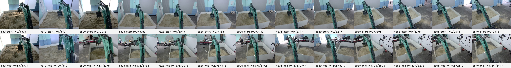
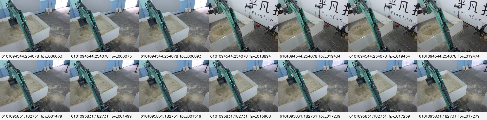

# FPV 视角变化对比记录（2026-06-11）

## 背景

用户观察到 `episode_26` 之后 FPV 视角发生变化。本文只整理视角差异，便于人工逐项观察，不直接修改训练、录制或推理代码。

本文使用的数据源：

- 原始 50Hz HDF5：`/media/mundane/EXTERNAL_USB/real_teleop_v1/episode_*.hdf5`
- 当前 20Hz 训练集：`/media/mundane/EXTERNAL_USB/real_teleop_v1_repaired_20hz_v1`
- 2026-06-10 live policy 测试帧：
  - `/media/mundane/EXTERNAL_USB/policy_control_tests/real_one_dig_v1_policy_test_20260610T094544.254078Z/fpv_frames`
  - `/media/mundane/EXTERNAL_USB/policy_control_tests/real_one_dig_v1_policy_test_20260610T095831.182731Z/fpv_frames`

当前 2026-06-10 policy bundle 的训练配置确认如下：

- 训练数据目录：`/media/mundane/EXTERNAL_USB/real_teleop_v1_repaired_20hz_v1`
- train-ready episode：`26, 29, 30, 32, 33, 34, 35, 36, 38, 39, 40, 41, 42, 43, 47, 48, 49, 50, 51, 53, 54, 55, 56, 57, 58, 59, 60, 61, 62, 63, 65`
- 低维输入：`low_dim_keys: [qpos]`
- 因此旧的 `episode_0..25` 不是这次 bundle 的训练输入，但可以作为视角变化参照。

## 总览图

下图每个 episode 抽了 start 和 mid 两帧。它只用于观察视角分布，不代表动作质量或 episode 是否 train-ready。

下图是 2026-06-10 两次 live policy 测试保存的 FPV 帧。

## 观察结论

### 1. `episode_0..20` 是旧近景视角

典型特征：

- 沙池和土面占画面主体，背景墙/门/地面较少。
- 挖机臂和 bucket 更靠近画面中心和下方。
- 画面更像“任务区域近景”，无关背景较少。

这批视角和当前 live policy 测试差别很大。如果把这批数据和新视角数据混训，需要显式做视角增强、分批验证或相机视角标签，否则模型可能学习到视角相关的错误特征。

### 2. `episode_24..25` 已经进入过渡/新视角

典型特征：

- 相机明显更高、更远。
- 白色沙池边框和右侧地面区域变多。
- 背景房间、桌椅、墙面等任务无关信息开始大量进入画面。

这说明视角变化不是从训练 manifest 的 `episode_26` 才突然出现；`24..25` 已经能看到变化趋势。但它们不在当前 20Hz train-ready manifest 中。

### 3. `episode_26..38` 是新视角早期子域

典型特征：

- 视角高远，沙池完整边框更明显。
- 挖机臂更偏画面中间竖向区域。
- 右侧地面和背景更多，但还没有后续 39+ 那么稳定地露出大面积右侧墙面/标识区域。

当前 bundle 的训练集中包含 `episode_26,29,30,32..38` 中的部分 train-ready episode。

### 4. `episode_39..65` 是新视角后期子域

典型特征：

- 右侧墙面、地面、工作台/标识等背景更稳定进入画面。
- 沙池在画面里显得更小，任务主体相对更分散。
- 与 2026-06-10 live policy 保存帧更接近。

这批 episode 也在当前 bundle 训练集中占比较大。随机 train/val split 会把这些视角子域混在一起，offline val loss 可能高估真实 live 泛化能力。

### 5. `episode_66..70` 和 live 测试更接近

典型特征：

- 高远视角仍然存在。
- 右侧墙面、地面和大面积无关区域明显。
- 与 2026-06-10 live policy 测试帧风格接近。

但 `episode_66..70` 不在当前 20Hz train-ready manifest 中。若 live 测试主要落在这个子域，当前模型可能缺少足够同分布训练样本。

## 对当前 FPV 泛化判断的影响

1. 这次 2026-06-10 bundle 不是简单的“旧视角 0-25 混到新视角 26+”。训练 manifest 已经只使用 26+ train-ready 数据。

2. FPV 问题仍然成立，但应拆成两类：
   - 视角/extrinsic 子域变化：0-20、24-25、26-38、39-65、66-70/live。
   - 同一视角内的土体形态、阴影、bucket/土堆遮挡变化。

3. 后续评估不要只随机切 train/val。建议增加按采集批次或视角子域的 held-out：
   - train：26-38，val/live-like：39-65。
   - train：39-65，val：26-38。
   - `66-70` 因 IMU 分布不同，当前阶段只作外部观察，不作为主 held-out。

4. 如果做中心 ROI zoom，当前阶段 ROI 应以 `39-65` 为主要参照，而不是以 `0-20` 老近景视角为参照；`66-70/live` 只作为后续外部参考。

5. 中心放大/裁剪的风险是裁掉 swing/return 阶段可能需要的边界、沙池位置和 bucket 远端信息。应先做离线敏感性检查：固定同一组 qpos，只替换原图、中心 zoom 图、不同 ROI 图，比较 action 稳定性。

## 建议下一步

当前阶段先只考虑 `episode_26..65`。`episode_66..70` 因 IMU 分布不同，暂不纳入主训练、
主评估或 ROI 参数选择，只作为后续外部参考。

1. 建立 `26..65` 分组 manifest。
   - `26..38`：新视角早期子域。
   - `39..65`：新视角后期子域，更接近 2026-06-10 live 保存帧。
   - 对每条 episode 标注 `train_ready / fail / warn / info`、失败原因和是否可修复。
   - manifest 第一阶段只用于 held-out 评估、均衡采样和数据审计，不把 group id 喂给 policy，避免模型学成“按视角标签走不同轨迹”。

2. 主监督训练仍以 train-ready 数据为准。
   - 当前 train-ready 继续作为行为克隆主数据源。
   - fail episode 不整条直接加入监督训练，先按失败原因拆分：qpos/branch jump 周围窗口 mask 掉，FPV gap 周围沿用 `train_exclude_mask` 思路，剩余连续健康窗口再评估是否可进入训练。
   - bucket semantic outlier 先人工复核，不确认前不作为成功动作标签训练。

3. 充分利用 fail 数据里的 FPV 信息。
   - 从 fail episode 抽 FPV，用于统计新视角背景、亮度、阴影和土面纹理分布。
   - 用 fail FPV 做固定 qpos replay：固定 train-ready qpos，只替换不同 FPV，观察 policy action 是否随背景/土面细节大幅变化。
   - fail FPV 可参与视觉增强参数设计和 held-out FPV 敏感性测试，但不直接绑定其失败动作标签。

4. 实现训练/推理共用的 FPV transform，不只做 ROI。
   - 确定性预处理候选：原图、中心 ROI zoom `0.85`、中心 ROI zoom `0.75`、ROI + 轻微 Gaussian blur、ROI + downsample-upsample 低通。
   - 可选固定 mask：遮掉稳定无关区域，例如右侧墙面、地面、工作台或标识区域；mask 方案要用分组 replay 验证，不能只靠肉眼选。
   - 训练和实时推理必须使用同一套确定性预处理，避免再次制造 train/live 分布差。

5. 加训练时随机增强，推理时不随机增强。
   - 推荐：brightness/contrast/gamma、轻微 saturation/hue、JPEG quality jitter、轻微 blur/noise、小幅 translation/scale、局部 shadow augmentation。
   - 暂不优先：水平翻转、大角度旋转、强透视、MixUp/CutMix。这些会破坏 swing 左右语义或动作标签物理一致性。

6. 同时训练和比较低视觉依赖 baseline。
   - `qpos-only`：用于判断任务中有多少动作可只靠机器姿态拟合，但不直接作为最终闭环方案。
   - `raw FPV + qpos`：当前基线。
   - `processed FPV + qpos`：验证 ROI/低通/增强是否降低 FPV 过敏。
   - 如果 phase label 可用，再加 `processed FPV + qpos + phase`，减少相近 qpos 下 dig/carry/dump/return 的阶段歧义。

7. 记录实时 FPV transform 延迟。
   - 预估 center crop + resize 约 `1-3 ms`，ROI + blur/downsample 约 `2-6 ms`，应远小于当前 ACT 前向约 `50 ms`。
   - 仍需实际记录 `fpv_decode_ms`、`fpv_transform_ms`、`tensor_copy_ms`、`model_forward_ms`，不要只看总循环 Hz。

8. 评估时按视角子域报告，不只看随机 val loss。
   - 随机 train/val 只能作为 smoke 指标。
   - 需要固定报告：`26..38 -> 39..65`、`39..65 -> 26..38`，以及全 `26..65` 下的分组误差。
   - 每次 live 前做固定 qpos、多组 FPV 替换实验，先确认 action 对 FPV 背景和土面变化不过敏，再上真机。
