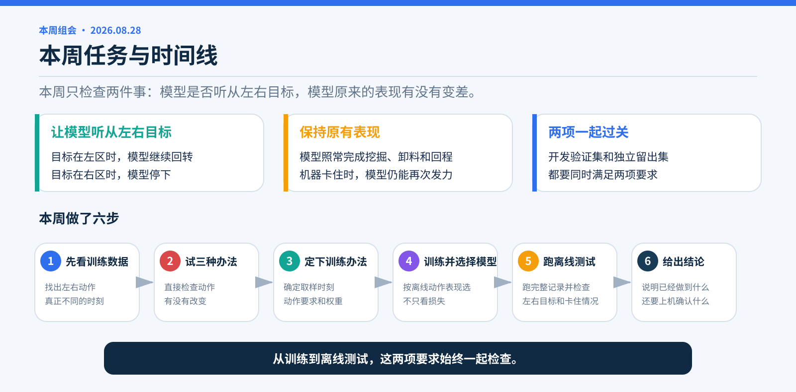
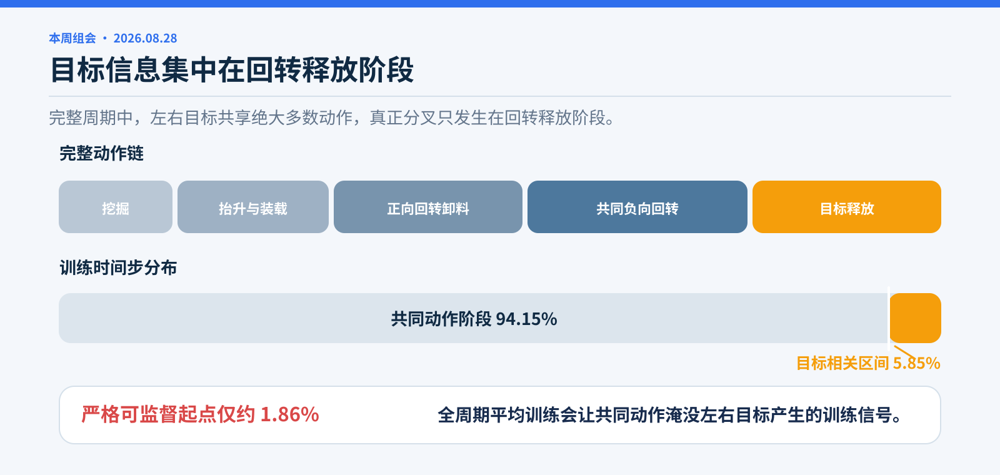
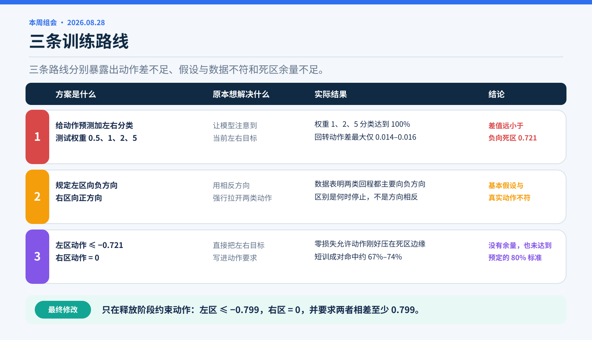
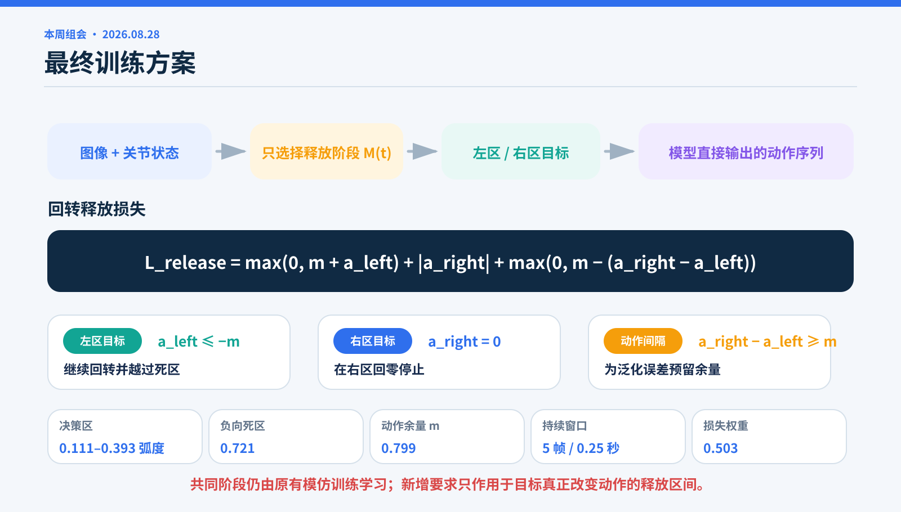
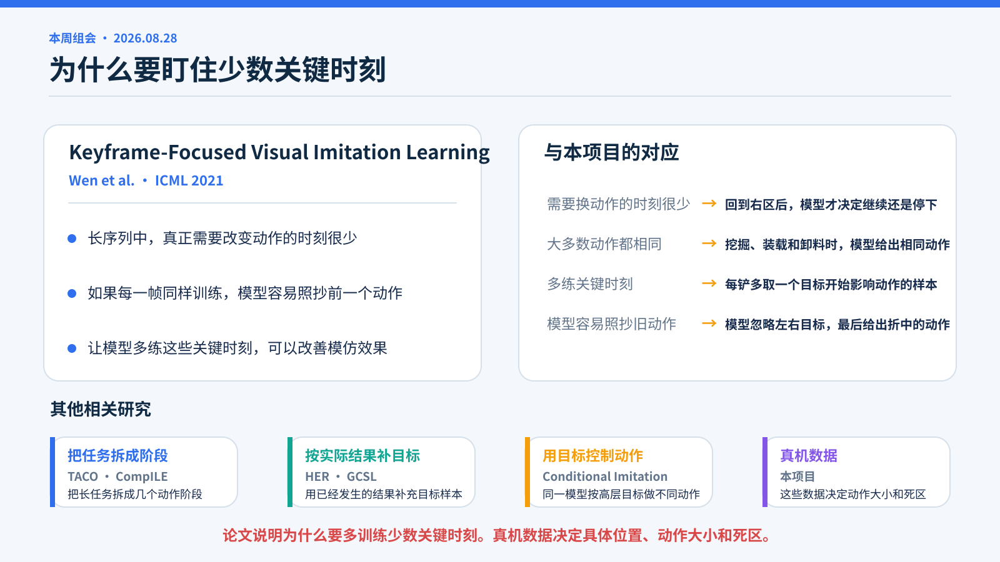
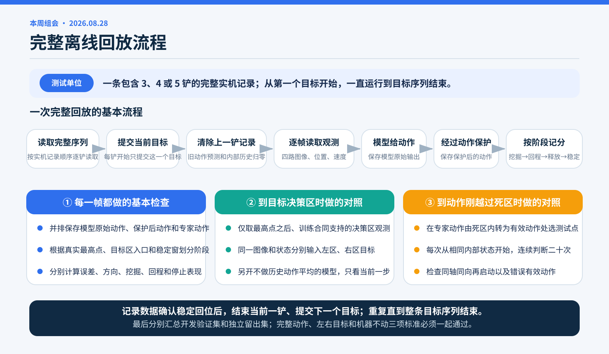
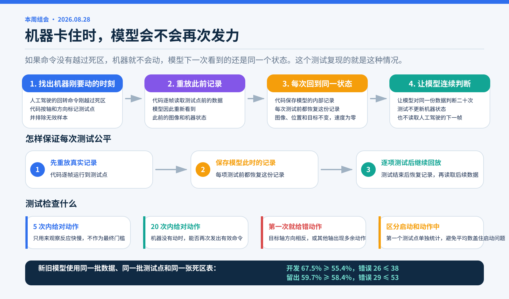
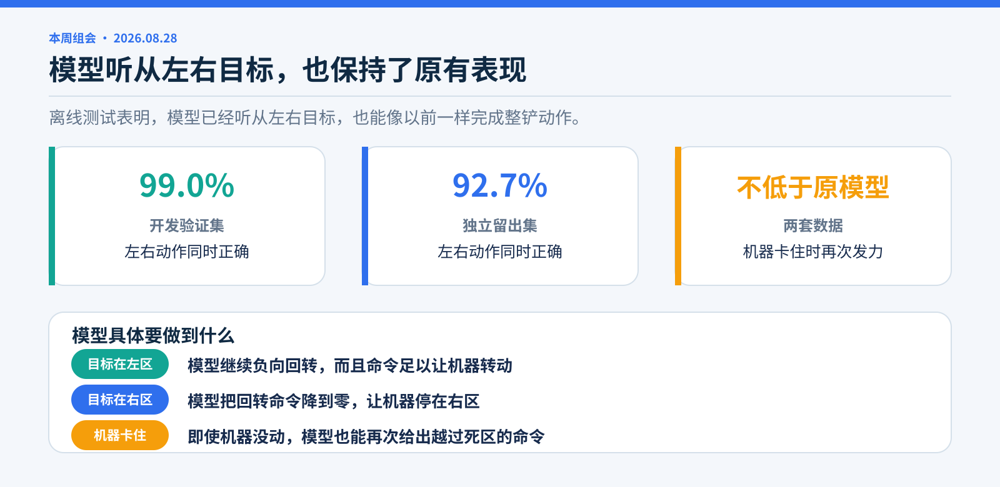
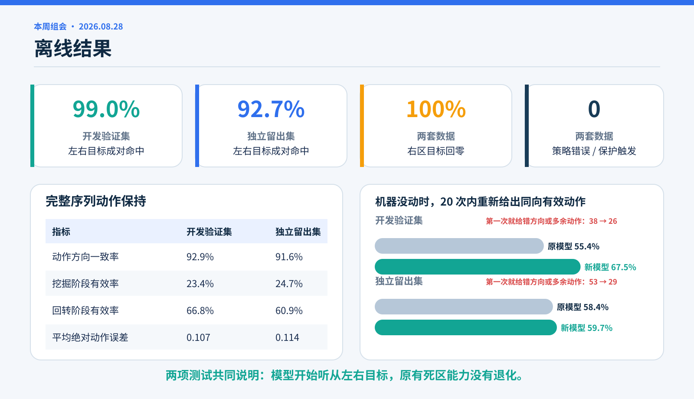

# 从条件输入到可执行动作约束

**本周组会 · 2026-08-28**

> 新的回转释放损失让模型按照左右分区目标改变动作，同时保留原一铲模型的普通动作和死区能力。

## 本周任务

第一项任务是增加左右目标响应。回程进入右区时，左区目标要求模型继续负向回转，右区目标要求模型回零停止。

第二项任务是保留原一铲模型的能力，包括普通挖掘、卸料、回程，以及机器不动时重新给出越过死区的动作。

两项任务共同构成模型的离线验收标准。

## 1. 确认目标影响动作的时刻

训练集共有 40,595 个时间步和 60 个完整周期。左右分区目标共享约 94.15% 的动作，目标相关区间约占 5.85%，可用于左右对照的起点约占 1.86%。

数据表明，两类目标在挖掘、装载、卸料和大部分回程阶段都应该执行相同动作。差别只出现在回程经过右区、需要决定继续向左回转还是在右区停止的短暂阶段。

据此确定两个评估维度：

1. 同一个画面和姿态下，左右目标是否产生不同的回转命令。
2. 新增目标训练后，普通动作和死区能力是否保持。

## 2. 验证三条训练路线

### 路线一　增加左右分类

具体做法是在模型的动作预测上增加左右分类，并分别测试 0.5、1、2、5 的损失权重。原本希望分类压力能迫使模型注意当前目标。

权重为 1、2、5 时，左右分类准确率达到 100%。同一个状态只换目标后，回转动作的最大差值约为 0.014–0.016，远低于负向机械死区 0.721。分类结果没有转化为机械有效动作。

### 路线二　规定相反方向

这条路线打算用方向直接拉开两类动作：左区使用负向回转，右区使用正向回转。

真实数据中，两类目标在回程阶段都主要使用负向动作。区别在于负向回转何时释放，而非动作方向相反。

### 路线三　把动作压到死区边缘

第三条路线直接要求左区动作不高于 −0.721、右区动作回到 0，并要求两者至少相差 0.721。

损失降到零时，左区动作仍可停在死区边缘。三组 80 轮短训的左右成对命中率为 67.0%、67.8% 和 74.3%，低于 80% 的验收标准。

### 最终调整

左区目标幅值改为训练数据中有效动作的中位数 0.799，右区保持回零，两者至少相差 0.799。该幅值为死区外的动作留出真实数据支持的余量。

## 3. 确定训练方案

### 释放阶段取样

训练只选择回转最高点之后、位于右区决策范围内、且专家动作明确支持继续或停止的时刻。每个完整周期额外取一个这样的样本，避免候选点多的周期在训练中占据过多权重。

### 回转释放损失

同一个画面和姿态分别输入左区、右区目标。左区要求前五步继续输出不高于 −0.799 的回转动作；右区要求前五步回到 0；同时要求两组动作至少相差 0.799。

### 参数来源

右区决策范围、机械死区、0.799 的动作目标和五帧持续窗口来自训练数据。原训练损失与新增损失的初始量级给出权重 0.503。

### 保留原有一铲训练

原有模仿训练、死区损失和“机器不动时重新给动作”的训练采样仍然保留。新增损失只负责回转释放阶段，不重新规定整个周期的动作。

### 论文依据

[Keyframe-Focused Visual Imitation Learning](https://proceedings.mlr.press/v139/wen21d.html) 指出，长序列中真正改变行为的动作变化点很少，均匀训练容易让大量重复动作淹没这些关键时刻。这与本项目把额外训练集中到回转释放阶段的做法一致。

[TACO](https://proceedings.mlr.press/v80/shiarlis18a.html) 和 [CompILE](https://proceedings.mlr.press/v97/kipf19a.html) 支持把长任务按动作阶段拆开学习。具体动作要求、死区阈值和余量由真机数据与执行器特性确定。

## 4. 训练与模型选择

训练运行 300 轮，最低验证损失出现在第 140 轮。多个保留版本继续接受动作验收。

第 199 轮模型同时通过左右目标、普通动作和机器不动三类标准，成为最终候选。

## 5. 离线测试

### 完整序列流程

1. 从开发验证集或独立留出集中取出一条完整实机记录。每条记录包含 3、4 或 5 铲，并带有每一铲的左右目标顺序。
2. 开始一铲前，脚本规划器只提交这一铲的目标。模型会清空上一铲留下的动作预测和内部历史，避免旧目标影响新一铲的第一步。
3. 按原始 20 Hz 顺序逐帧读取四路图像、关节位置和关节速度。模型给出动作后，再经过与运行时一致的动作保护程序。每一帧同时保存模型原始动作、保护后的动作和专家动作。
4. 根据记录中的真实回转位置划分阶段：到回转最高点为挖掘与卸料；从最高点回到目标区为回程；进入目标区直到连续十帧低速度稳定为释放和回位。
5. 回程经过右区决策范围时，追加一次“同一个状态只换左右目标”的对照。专家动作刚从死区内变成有效动作时，记录一个“机器没动时重新判断”的测试点。
6. 记录数据确认目标区稳定回位后，当前一铲结束，规划器提交下一铲目标。重复以上步骤，直到整条目标序列结束。
7. 最后分别汇总开发验证集和独立留出集。完整动作、左右目标和机器不动三类指标必须一起通过。

周期推进以记录中的稳定回位边界为准。

### 左右目标对照

每一铲经过回转最高点、进入训练数据支持的右区范围后，代码最多均匀取十六个时刻。每个时刻的四路图像、关节位置和关节速度完全相同，只把目标分别改成左区和右区。

为了避免前几步动作平均影响结果，代码另开一个不使用历史动作平均的模型副本，并在每次判断前清空内部记录。比较的是模型在当前这一步直接给出的命令。左区命令必须达到负向机械有效幅值，右区命令必须留在死区内。两项在同一个时刻同时正确，才算一次成对命中。

### 机器不动测试

1. 在专家动作刚从死区内变为机械有效动作的位置选一个测试点，并剔除原数据中不可训练或不完整的时刻。
2. 从这段数据开头逐帧运行到测试点，还原模型当时对过去几步的内部记录。
3. 保存模型此刻的内部状态。每次测试一个轴和方向前，都恢复到这份完全相同的状态。
4. 保持图像、关节位置和左右目标不变，把关节速度设为零，然后让模型在同一个状态下连续判断二十次。模型动作不会让状态前进，也看不到专家随后已经让机器动起来的下一帧。
5. 检查二十次以内是否重新给出了同一轴、同一方向、且越过死区的动作；同时记录第一次判断是否给了反方向或多余的其他轴动作。
6. 测试结束后恢复模型状态，再继续读取真实记录。这样一个测试点不会影响下一个测试点。

每段数据的第一个测试点单独统计，用来判断模型能否从静止开始；其余测试点检查动作过程中能否继续给出有效动作。前五次只观察反应快慢，最终验收看二十次以内能否重新给出有效动作。

### 状态数据来源

动作积分方案在专家动作回放中产生了数弧度的位置误差，也无法同步生成对应相机画面。离线测试因此使用记录中的真实图像、位置和速度。

这部分评价模型在已记录状态下给出的命令，以及机器不动时的重复决策。

### 验收标准

开发验证集和独立留出集分别要求：动作误差不超过 0.13，方向一致率不低于 90%，左右目标成对命中不低于 80%，右区停止不低于 95%；挖掘和回程表现至少达到对应专家数据的 80%。同时要求所有动作数值正常、策略运行无报错、动作保护不被触发。

机器不动测试在相同数据、测试点和死区表上对比原一铲模型。新模型的同向有效动作比例不低于原模型，错误方向或多余动作次数不高于原模型。

对应代码为：[完整序列和左右目标测试](../../testbed/testbed/cli/planner_open_loop_replay.py)、[机器不动测试](../../testbed/testbed/cli/state_hold_transition_replay.py)和[汇总验收](../../testbed/testbed/cli/real_transition_acceptance.py)。

## 6. 结果

### 左右目标响应

开发验证集的左右成对命中率为 99.0%，独立留出集为 92.7%；两套数据中，右区目标的回零率都是 100%。这说明同一个状态只换左右目标时，模型能够分别给出继续回转和停止回转两种机械命令。

### 原有能力保持

普通动作方向一致率在两套数据中分别为 92.9% 和 91.6%。挖掘、回程、动作误差、策略运行和动作保护也全部通过预定标准。

机器保持不动时，二十次判断内重新给出同向有效动作的比例，在开发验证集由原模型的 55.4% 提高到 67.5%，在独立留出集由 58.4% 保持到 59.7%。第一次就给错方向或多余动作的测试点数也从 38 降到 26、从 53 降到 29。

完整序列回放覆盖左到左、左到右、右到左、右到右四种转换。

### 结论

新的回转释放损失增加了左右目标响应，同时保留原一铲模型的普通动作和死区能力。

当前结论来自离线动作测试；液压响应、实际目标区域和连续多铲运行由真机测试确认。
