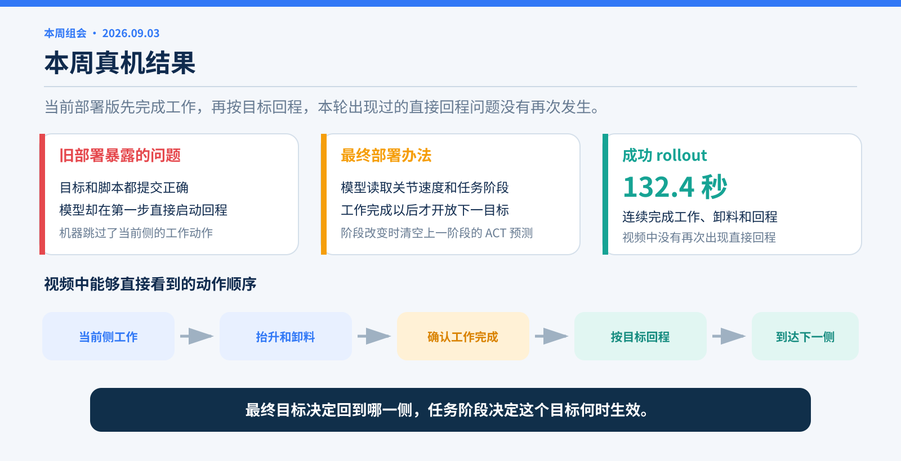
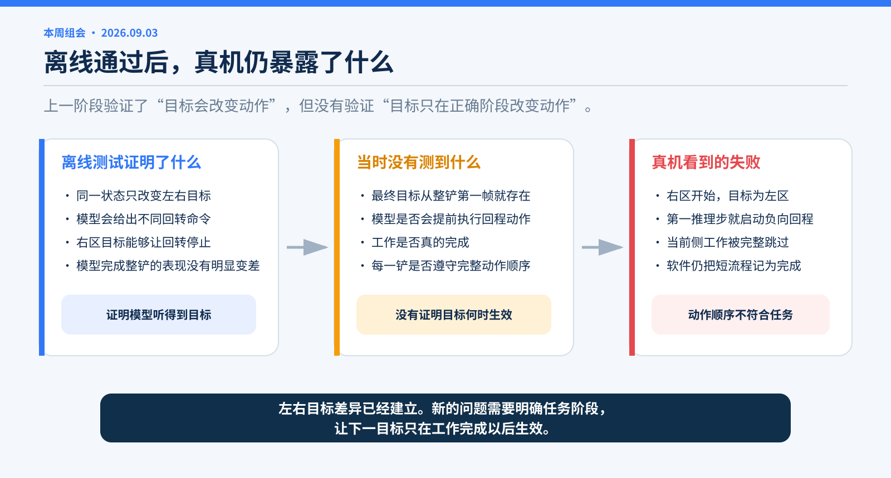
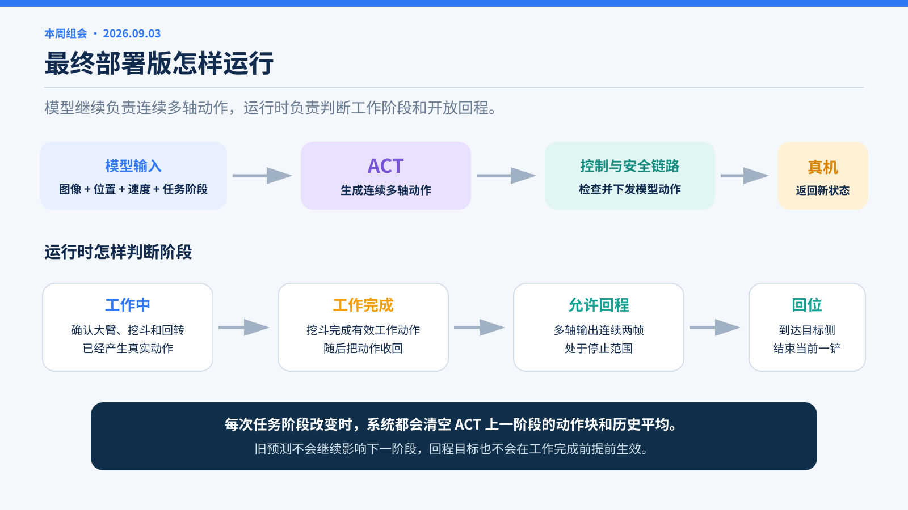
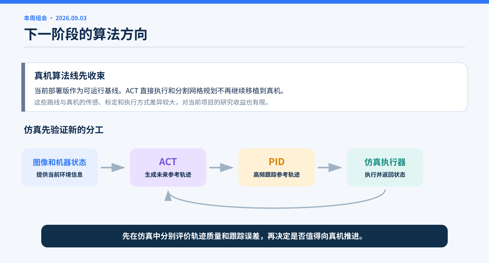
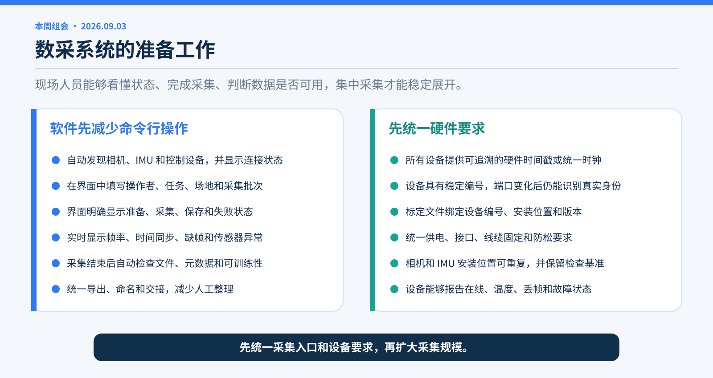
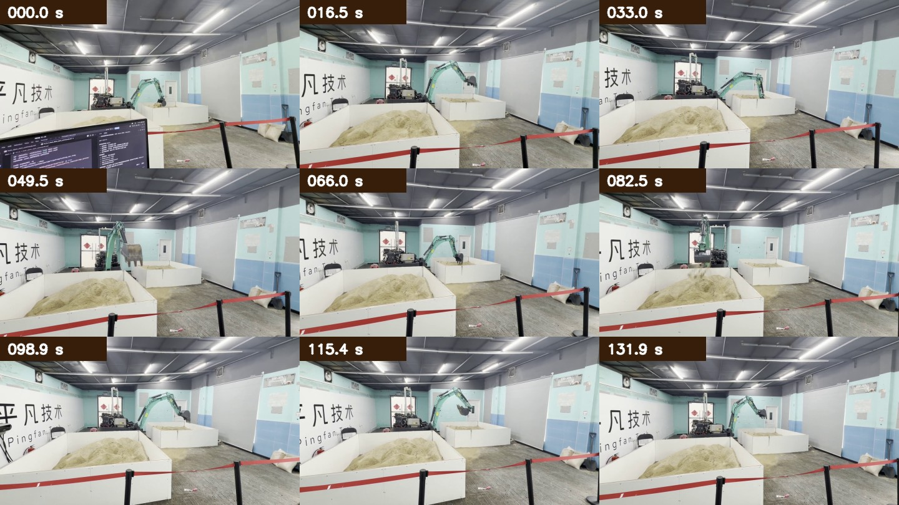

# 真机连续 rollout 与下一阶段工作

**本周组会 · 2026-09-03**

> 本周真机实验连续完成了当前侧工作、抬升卸料、按目标回程和回到下一工作侧。部署前出现的直接回程问题没有再次发生。最终方案与上一阶段的设想有所不同：脚本只规定回到哪一侧，运行时决定这个目标何时交给 ACT。



## 本周结果

成功 rollout 持续约 132.4 秒。视频中能够看到挖机连续完成工作动作、抬升卸料、回转和回到下一工作侧，没有再次从起点直接回程。

当前部署版让模型同时读取关节速度和任务阶段。运行时根据已经发生的物理动作推进阶段，工作完成以后才开放下一目标。每次阶段改变时，系统都会清空 ACT 在上一阶段留下的预测。

## 1. 上一阶段的离线结论少了一项检查



上一阶段的训练和离线测试证明，同一个状态只改变左右目标时，模型会给出不同的回转命令。这说明模型能够听到脚本目标，也支持用一个模型执行左右两种动作。

当时没有完整检查另一件事：最终目标是否会在整铲开始时过早影响动作。离线回放沿着已经录好的完整动作顺序前进，能够检查回程位置上的左右差别，却不能单独保证模型会先完成当前侧工作。

第一次连续脚本真机实验暴露了这个缺口。机器从右区开始，当前目标是左区。模型在新一铲的第一个推理时刻直接给出 −0.8407 的负向回转命令，随后立即回到左区，跳过了右区工作。

现场日志确认，脚本选择、左右目标、模型重置和安全链路都工作正常。异常命令来自模型直接输出。模型知道最后要去左区，却没有得到“当前仍在工作”和“现在还不能回程”的明确信息。

## 2. 解决过程中遇到的问题

| 问题 | 实际表现 | 处理办法 |
| --- | --- | --- |
| 最终目标过早生效 | 右区开始、目标为左区时，模型可能第一步就回程 | 增加明确的任务阶段，工作完成前不向模型公开下一目标 |
| 只靠关节位置猜阶段 | 相近位置可能同时出现在工作准备和回程经过时 | 加入关节速度，并把工作、工作完成和允许回程写入模型输入 |
| 用更强惩罚禁止提前回程 | 提前回程减少，正确的工作起步也随之下降 | 停止继续加大单项惩罚，改用数据支持的任务阶段来区分动作 |
| 离线测试组合不符合真实数据 | 把回程状态的速度改成零后再指定回程动作，模型同时收到互相矛盾的信息 | 回到真实记录中的图像、位置和速度，只在数据支持的状态上确定要求 |
| 任务阶段依赖人工按钮 | 模型能够离线运行，现场却不能自动完成连续流程 | 脚本负责目标顺序，运行时根据已经发生的动作自动推进阶段 |
| 阶段改变后仍混入旧预测 | 新输入已经生效，上一阶段的动作块仍会影响当前输出 | 每次阶段改变时重置 ACT，清空旧动作块和历史平均 |
| 静止检查和运动验收混在一起 | 无动作检查无法产生工作进度，却可能被当成流程失败 | 静止检查只验证输入、推理和锁零；完整阶段顺序由受控运动验证 |

这些问题指向同一个缺口：上一阶段把“最终去哪一侧”和“当前正在做什么”放进了同一个条件里。最终部署版把两件事分开处理。

## 3. 最终部署版怎样运行



### 模型读取位置、速度和任务阶段

最终模型的低维输入包括：

```text
关节位置 + 关节速度 + 任务阶段
```

任务阶段告诉模型五件事：机器当前在哪一侧、本铲在哪一侧工作、工作是否完成、是否已经允许回程，以及允许回程后应该去哪个目标侧。

工作尚未完成时，模型只看到当前侧的工作要求。运行时确认可以回程以后，下一目标才会生效。因此，左区或右区目标不会在整铲第一帧就把模型拉向终点。

### 运行时自动推进阶段

每一铲从“工作中”开始。运行时依次确认：

1. 大臂和挖斗已经相对起点产生真实位移。
2. 回转已经完成当前侧工作所需的正向移动。
3. 模型持续给出有效的挖斗工作动作，随后又把动作收回。
4. 模型的多轴输出连续两帧处于停止范围。

前三项完成后，运行时把阶段改为“工作完成”。模型的多轴输出连续两帧处于停止范围后，运行时才改为“允许回程”，并把下一目标交给 ACT。所有判断只使用当时和此前已经发生的信息，不读取未来状态。

### 阶段改变时重置 ACT

ACT 每次会预测接下来一段动作，并把多个时刻的预测进行平均。如果任务阶段已经改变，上一阶段留下的预测仍可能继续影响当前输出。

最终部署版在任务阶段改变时清空旧动作块和历史平均。新阶段的第一次输出只受当前输入影响，不再混入工作阶段或回程阶段的旧命令。

自动推进不会生成控制命令。ACT 仍然负责连续多轴动作，运行时只负责在正确时刻开放下一阶段。

## 4. 离线检查和真机结果

自动阶段推进在 30 条未参与训练的完整记录中都能依次进入“工作完成”和“允许回程”。其中 8 条右区到左区记录在允许回程前都没有提前出现有效负向回转，允许回程后都给出了有效负向动作。

离线结果只能检查记录状态上的动作顺序。本周真机 rollout 补上了液压系统实际执行后的状态变化。设备完成了连续工作、卸料和回程，部署前出现的直接回程没有再次发生。

当前结论适用于这套模型、运行时、设备和现场条件。一次成功 rollout 不能证明任意地形、初始姿态和长时间运行都不会失败。它已经足以说明本轮部署问题得到解决，因此真机算法线可以先停在当前可运行版本。

## 5. 下一阶段的算法工作



此前仿真中让 ACT 直接充当执行器的路线，以及基于分割网格的规划器，不再继续移植到真机。仿真和真机的传感、标定和底层执行方式差异较大，这两条路线对当前真机问题的帮助有限，对本项目的研究贡献也不够明确。

接下来先与同事合作，把新的仿真实验跑通。新的控制分工很简单：

1. ACT 根据图像和机器状态生成一段未来参考轨迹。
2. PID 按较高频率跟踪这段轨迹，并向仿真执行器发送控制量。
3. 仿真器把新的机器状态反馈给 ACT 和 PID，形成闭环。

ACT 负责轨迹内容，PID 负责把轨迹执行出来。实验分别评价轨迹是否合理、PID 跟踪误差多大，以及完整任务能否完成。第一阶段只在仿真中验证，再根据结果决定是否值得向真机推进。

## 6. 同步准备数采系统



软件侧先减少命令行操作。采集人员应该能够在一个界面里看到设备连接、时间同步和存储状态，填写任务与批次信息，开始或停止采集，并在结束后立即知道数据是否完整、能否用于训练。

硬件侧先形成一份基本要求。要求至少包括统一时间或可追溯时间戳、稳定的设备编号、与设备绑定的标定文件、可重复的安装位置、统一供电与接口，以及设备健康状态。先把这些要求说清楚，后续集中采集才不会把大量时间花在重新接线、识别设备和修复元数据上。

## 7. 接下来的工作

1. 先与同事把仿真环境跑起来，建立 ACT 轨迹输出和 PID 跟踪的最小闭环。
2. 确定轨迹接口，只保留执行所需的位置、速度和时间信息。
3. 记录当前数采流程中需要手动敲命令、人工判断和事后补文件的环节。
4. 画出面向采集人员的软件流程，并整理第一版硬件要求。
5. 保留当前真机部署版作为基线。只有现场日志再次出现明确问题时，才重新进入真机算法修改。

## 成功 rollout

<video controls preload="metadata" poster="../assets/one_dig_success_rollout_20260903_contact_sheet.jpg" width="100%">
  <source src="../assets/one_dig_success_rollout_20260903_web.mp4" type="video/mp4">
</video>

[播放或下载成功 rollout 展示版](../assets/one_dig_success_rollout_20260903_web.mp4)

[](../assets/one_dig_success_rollout_20260903_web.mp4)

原片为 1920×1080，时长约 132.4 秒，SHA-256 为
`96aad93d1c21a7aa89c21d22bd092ca61bf9eb7da6b68c8fa2db24b1035d4308`。仓库附带的 720p 展示版保留完整时长，SHA-256 为
`4afc54d7bfe701bb126df412d574155e41fb483845bf97b1ca05f888e89eb5c3`。

相关记录：

- [第一次连续脚本真机反馈](../real_transition_target_release_deployment_feedback_20260829.md)
- [任务阶段模型离线实验](../real_transition_task_state_v2_offline_experiment_20260902.md)
- [自动推进运行时](../real_transition_task_state_v2_automatic_runtime_20260902.md)
