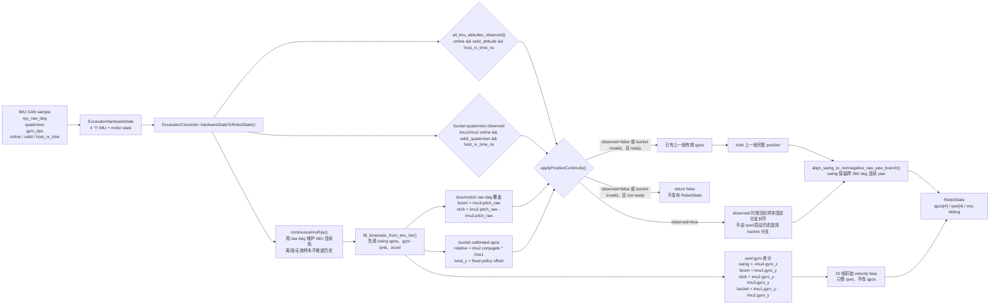
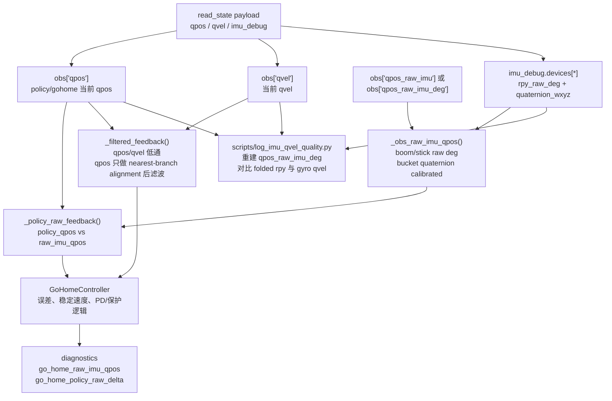
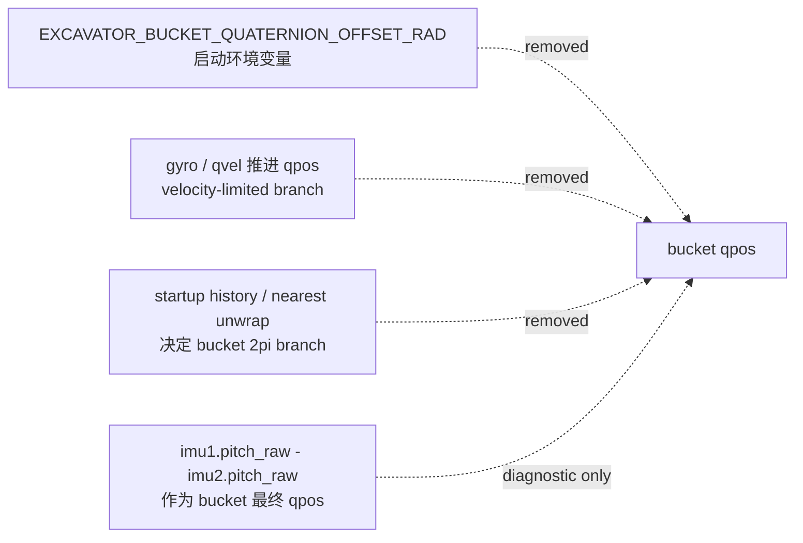
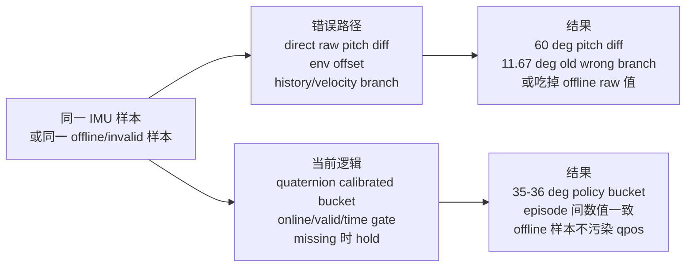
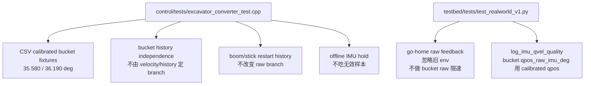

# Qpos Raw-Deg 解算逻辑

本文记录当前真机栈里 qpos/qvel 的解算口径。它描述的是代码当前行为，不是期望中的未来设计。

核心约定修正为：boom/stick 使用 `rpy_raw_deg` 的 canonical 分支，bucket 最终 policy qpos 使用 IMU1/IMU2 quaternion relative twist 加固定 policy-frame offset。`rpy_raw_deg` 仍然是诊断、分支一致性验证和 boom/stick 绝对分支来源；gyro 只进入 qvel 和诊断，不通过积分、速度限幅或方向补偿推进 qpos。

## Runtime 主链路

`continuousImuRpy()` 仍然存在，但它不决定 boom、stick、bucket 的最终 qpos 分支。它主要保留两类职责：swing yaw 的连续分支，以及 IMU 无效时不让历史状态被坏样本推进。真正写入非 swing qpos 的，是 `hardwareStateToRobotState()` 后半段的 boom/stick raw-deg 覆盖和 bucket quaternion calibrated 覆盖。

当前 qpos 的物理映射是：

| axis | qpos source |
| --- | --- |
| swing | `imu4.rpy_raw_deg[2]` 对齐到非负 raw yaw 分支，并允许 359 deg 到 361 deg 这类跨零连续值 |
| boom | `deg_to_rad(imu3.rpy_raw_deg[1])` |
| stick | `deg_to_rad(imu2.rpy_raw_deg[1] - imu3.rpy_raw_deg[1])` |
| bucket | `signed_twist_y(imu2.quaternion.conjugate() * imu1.quaternion) + fixed_policy_offset` |

bucket 的固定 policy offset 是本地代码常量，不再由 `EXCAVATOR_BUCKET_QUATERNION_OFFSET_RAD` 启动环境决定。当前数值为 `-0.4060066694119653 rad`，即 `-23.262468611471 deg`。它的作用是把 IMU1/IMU2 relative quaternion twist 的零点平移到 policy/home 使用的 bucket qpos 坐标系；它不是 gyro 补偿、滤波项或 2pi 分支修正。

维护这个 offset 时必须同步三处本地常量：C++ runtime `control/src/excavator/excavator_converter.cpp`，go-home raw feedback `testbed/testbed/backends/real/go_home.py`，以及日志重建脚本 `scripts/log_imu_qvel_quality.py`。同步后至少运行 converter 测试、`testbed/tests/test_realworld_v1.py` 和 `git diff --check`。历史 CSV 里的两条代表行说明了这个坐标系：

| CSV row | old/final qpos | canonical raw-imu qpos | direct raw pitch diff | current calibrated qpos |
| --- | ---: | ---: | ---: | ---: |
| `20260611T133653... row0` | `35.580 deg` | `35.580 deg` | `60.360 deg` | `35.580 deg` |
| `20260611T130940... row0` | `11.670 deg` wrong branch | `36.190 deg` | `60.650 deg` | `36.190 deg` |

qvel 的物理映射仍来自 gyro，而不是 qpos 差分：

| axis | qvel source |
| --- | --- |
| swing | `-deg_to_rad(imu4.gyro_dps[2])` |
| boom | `deg_to_rad(imu3.gyro_dps[1])` |
| stick | `deg_to_rad(imu2.gyro_dps[1] - imu3.gyro_dps[1])` |
| bucket | `deg_to_rad(imu1.gyro_dps[1] - imu2.gyro_dps[1])` |

`all_imu_attitudes_observed()` 要求每个 IMU 同时满足 `online != 0`、`valid_attitude != 0`、`host_rx_time_ns != 0`。bucket 还要求 IMU1/IMU2 quaternion 在线、有效且可归一化。如果 converter 尚未有上一帧有效 position，这类 invalid/default-not-ready 样本会使 `hardwareStateToRobotState()` 返回 false；已有 ready 后才由 `applyPositionContinuity()` hold 上一帧完整 qpos。这个行为是全 position hold，不是单轴 hold。

## Python 侧消费链路

`GoHomeController` 里有两个不同概念：`qpos` 是桥返回的当前姿态，`qpos_raw_imu` 是从显式字段或 `imu_debug` 反推出来的 raw IMU 姿态。显式字段优先；没有显式字段时，`_obs_raw_imu_qpos()` 对 swing/boom/stick 使用 raw deg，对 bucket 使用和 C++ 一致的 quaternion calibrated helper。它会检查 `online`、`valid_attitude` 和 bucket quaternion validity，不读取或应用 `EXCAVATOR_BUCKET_QUATERNION_OFFSET_RAD`。

go-home 的 qpos 滤波不会生成新的物理分支。它先把当前 `qpos` 对齐到上一帧 filtered qpos 的最近分支，再做低通。这个滤波只用于 go-home 控制和诊断输出；它不把 gyro 积分回 qpos，也不对 `qpos_raw_imu` 做 bucket 速度限幅。

`scripts/log_imu_qvel_quality.py` 是诊断旁路。它同时记录桥返回的 `qpos/qvel`、从 `imu_debug` 重建的 `qpos_raw_imu_deg`、从 folded `rpy_rad` 重建的 `qpos_folded_imu`、以及从 gyro 得到的 `qvel_raw_imu_rad_s`。这里的 folded rpy 只用来暴露主值折叠差异，不是 policy qpos 的来源；bucket 的 `qpos_raw_imu_deg` 不再是 raw pitch diff，而是 quaternion calibrated policy-frame qpos。

## 当前仍删除掉的旧问题路径

当前生产路径里不再存在这些 qpos 主路径：

测试里仍保留一个 `EXCAVATOR_BUCKET_QUATERNION_OFFSET_RAD` fixture，它的作用是证明旧 env 即使存在也会被忽略。启动脚本和生产 converter 不再暴露这个 env。

## 测试效果对比

下面这些测试不是为了覆盖形式，而是直接复现这次修法要消除的数值分支问题。它们的共同模式是：先构造一个会让旧逻辑走错坐标或分支的输入，再确认当前逻辑稳定落在固定 calibrated 坐标。

| 测试场景 | 修前表现 | 修后表现 |
| --- | --- | --- |
| `133653... row0` 的 IMU1/IMU2 quaternion 与 raw pitch | direct raw pitch diff 给 `60.36 deg` | bucket 输出 `35.580 deg`，匹配历史正确 `qpos_raw_imu_deg_bucket` |
| `130940... row0` 的 IMU1/IMU2 quaternion 与 raw pitch | 旧最终 qpos 为 `11.67 deg` wrong branch，direct pitch diff 为 `60.65 deg` | bucket corrected 输出 `36.190 deg` |
| bucket 先有启动历史，再输入同一 calibrated quaternion 样本 | 旧 velocity/history 分支可能影响最终 bucket | 有历史和无历史 converter 输出同一 calibrated qpos |
| boom 先见过 `0 deg`，再输入 `imu3.pitch_raw = 222.5 deg` | 历史 nearest unwrap 把 boom 折到 `-137.5 deg` | boom 保持 `222.5 deg`，有历史和无历史 converter 输出一致 |
| stick 先见过 `0 deg`，再输入 `imu2.pitch_raw - imu3.pitch_raw = 222.5 deg` | stick 可能跟随历史折到 `-137.5 deg` 分支 | stick 保持 `222.5 deg` raw 分支 |
| go-home 从 `imu_debug` 反推 bucket，且环境里仍设置旧 `EXCAVATOR_BUCKET_QUATERNION_OFFSET_RAD` | 旧 env 会改变 raw feedback 的 bucket 解释 | env 被忽略，raw feedback 使用本地固定 calibrated helper |
| go-home 先看到 bucket `0 deg`，下一帧 `imu_debug` bucket quaternion 变为 `120 deg` relative twist | 旧 `_limited_raw_imu_qpos` 会把 bucket 限到 `2.5 deg`，掩盖真实 calibrated qpos | raw feedback 保持 `120 deg + fixed offset`，不做 bucket raw 限速 |
| fresh converter 第一帧是 invalid/default-not-ready 样本，或 bucket quaternion invalid | `fill_kinematic_from_imu_hw()` 可能留下未校准临时 qpos 并返回成功 | `hardwareStateToRobotState()` 返回 false，不发布 RobotState |
| converter 已有上一帧有效 qpos，下一帧 `imu1.online=0` 但 raw/quaternion 字段被改成跳变值 | raw 覆盖或 quaternion 覆盖会吃掉 offline 样本 | `online` gate 让 `position_observed=false`，bucket hold 上一帧 |

这些例子对应当前 C++ 和 Python 回归：

## 这套逻辑保证了什么

bucket 的最终 qpos 回到和历史正确 CSV 一致的 policy-frame calibrated 坐标，而不是 raw pitch diff 坐标。gyro 的影响被限制在 qvel 和质量诊断里，不再反过来改变 qpos；启动历史也不再决定 bucket 的 2pi 分支。boom/stick 仍保持 raw-deg canonical 分支，避免同一物理姿态在不同 episode 里被历史 unwrap 到不同 alias。

仍需要注意的是，当前 missing/offline 语义是整组 qpos hold。只要任一 IMU 离线或姿态无效，或 bucket 所需 quaternion 无效，converter 会在已有有效 position 时保持上一帧完整 qpos。未来如果需要“某个 IMU 离线只 hold 受影响轴”，那应当作为单独设计切片处理，不能在现有修法里顺手改。
