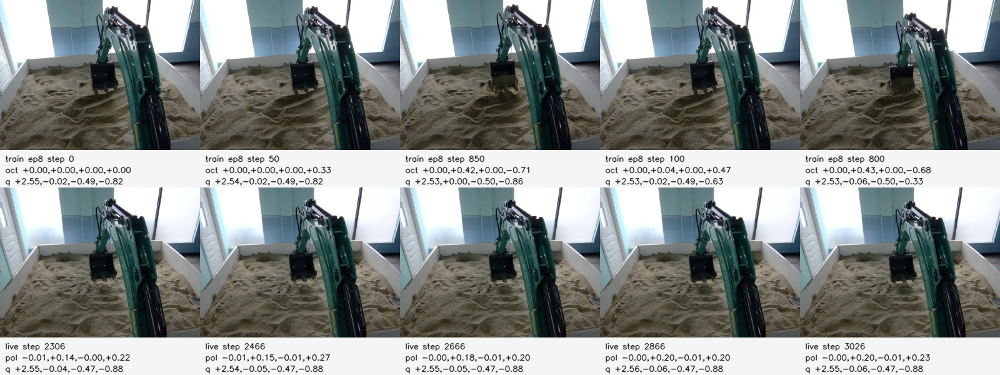

# Real One-Dig Policy 现场失败复盘 2026-06-02

## 结论

本次失败的直接表现是模型动作幅度太小，真机液压基本不响应。倒数第二次 control
日志为：

```text
/media/mundane/EXTERNAL_USB/policy_control_tests/real_one_dig_v1_policy_test_20260602T075821.662197Z
```

policy 段 724 帧里，`policy_action == safe_action == commanded_action`，动作没有被
`action_scale`、safety clip 或下发链路压小。模型输出本身偏小：

```text
policy_action p95abs = [swing 0.0116, boom 0.2129, stick 0.0109, bucket 0.2702]
```

历史现场死区估计约为：boom `0.35-0.45`，bucket `0.50-0.60` 才明显动。因此当前输出会落在液压死区以下。

## 交叉实验

为了定位是 qpos/qvel 还是 FPV 导致动作变小，做了单帧 reset 推理交叉实验：

- 训练图 + 训练 qpos/qvel：模型能输出大动作，例如 `boom≈0.50`、`bucket≈-0.73`。
- 训练图 + live qpos + qvel zero：仍能输出大动作，例如 `boom≈0.45`、`bucket≈-0.49`。
- live 图 + live/home/训练 qpos + qvel zero：输出都偏小，约 `boom≈0.14`、`bucket≈0.21`。
- 同一张 live 保存帧重新喂 Jetson bundle，输出与日志一致，说明部署 bundle 和记录链路没有整体损坏。

对比图：



上排是训练 sample frame，下排是本次 policy control 保存的 live FPV。live 场景在人眼看来合理，但对当前 overfit 模型来说已经明显偏离训练视觉分布。

## 判断

当前最可能原因是视觉泛化不足，而不是 qvel、qpos 或控制链路 bug。

训练 run 名称是：

```text
real_one_dig_v1_all9_zero_latent_dense_overfit
```

该模型只用 9 条轨迹训练，目标更接近 overfit 验证，不具备足够现场 FPV 泛化能力。现场 go-home 后的 bucket/boom 位置、沙堆形态、光照和相机视角稍有变化，模型就退回到保守均值动作。

## 频率问题

配置目标是 `control_hz=50`，但倒数第二次 policy 段实际新 policy action 频率只有约 `16.5-16.9Hz`：

```text
policy rows: 724
wall_time duration: 42.83s
policy inference latency: mean 51.6ms, p50 49.6ms, p95 58.0ms
image timestamp positive diff p50: 66.6ms
```

也就是说，控制 pump 可以 50Hz 重复发送最后一次动作，但 ACT 新推理动作不是 50Hz。原因是当前 Jetson 上单次 ACT 推理接近 50ms，已经超过 20ms 的 50Hz 周期。

更简单说：

训练时模型以为：
第 1 个动作、20ms 后第 2 个动作、40ms 后第 3 个动作...

部署时实际变成：
第 1 个动作、60ms 后第 2 个动作、120ms 后第 3 个动作...

这样 ACT 的时序会错，动作可能变慢、滞后、幅度被 temporal aggregation 平滑掉，尤其对挖斗这种需要连续时序的动作影响明显。

因此当前状态不是“ACT 实时看到 50Hz FPV”，也不是稳定 20Hz，而是新动作约 16-17Hz。底层 50Hz hold last action 只能维持 CAN/液压命令连续，不能改变 ACT 的时间语义。

如果训练数据统一到 50Hz，部署侧也需要让 policy 新动作接近 50Hz；否则 ACT chunk 的时间尺度和训练语义仍会错。50Hz 短期不现实，因为端到端每步必须小于 20ms，而当前单次推理 p50 已接近 50ms。实现 50Hz 需要组合优化：

- 降低训练/推理输入分辨率，例如 320x240、256x192 或 224x224。
- FP16/autocast，进一步尝试 ONNX/TensorRT FP16。
- 异步 policy worker：policy 尽快推理，control pump 继续 50Hz 发送最近动作。
- 更轻量 backbone/更小 ACT 配置，并重新训练。

20Hz 路线短期更可行：训练窗口和部署 policy 更新都按 20Hz 语义重建，control pump 仍 50Hz hold last action。此时 `chunk_size` 也要按真实时间重设；例如希望预测约 0.5s，则 20Hz 下 `chunk_size` 应约为 10，而不是继续用 25。

现有 9 条数据仍可用于 smoke/overfit 验证和对比实验，但不足以训练可泛化的视觉策略。若改 20Hz，不需要丢弃原始数据；应从原始 HDF5 重新构建 20Hz 窗口数据，并补录更多轨迹。

## 当前决策

当前不修改录制频率代码，继续按现场流程采集高频原始数据：

- HDF5 仍按 `record_hz=50` 保存 step、qpos/qvel、action、诊断和 FPV JPEG。
- control pump 仍以 50Hz 维持底层控制 heartbeat 和最新 safe action 下发。
- FPV 是否可用于训练由真实 `image_timestamp_ns_fpv`、`fpv_age_ms`、JPEG 解码和 QC 判断，不用 `record_hz` 代替相机真实帧率。

训练侧不直接把 50Hz HDF5 当成 50Hz policy 语义使用。录制完成后，从原始 HDF5 离线重建 20Hz 训练数据：

- 按真实时间戳或 `image_timestamp_ns_fpv` 选取 20Hz 样本。
- 对重复 FPV timestamp 去重，避免把同一张图当成多个新视觉观测。
- 保留并检查 action/sample/send/joint/image 时间戳，确认 action label 和 observation 没有系统性错位。
- 20Hz 下若希望 ACT 预测约 0.5s，`chunk_size` 用 10-12；若希望预测约 1.0s，`chunk_size` 用 20。

部署侧先按 20Hz policy 更新语义实现，底层仍 50Hz：

- policy worker 目标更新频率先设为 20Hz。
- 优先在新 FPV timestamp 到达时推理；没有新图时不重复做完整视觉前向。
- control pump 50Hz 发送最新 safe action 或 ACT chunk 中后续 action。
- 记录并限制 `policy_action_age_ms`；若 action age 或 FPV age 超过阈值，guard 归零或平滑归零。

25Hz 可作为下一档目标，但需要先把端到端 policy 推理 P95 降到 40ms 以下。当前 p95 约 58ms，只适合先做 20Hz 方案和推理优化。

## 下一步

1. 继续按 50Hz 原始 HDF5 流程补录数据。录制频率代码暂不改，录后用 QC 检查 `camera_unique_fps >= 20`、`image_gap > 100ms`、`fpv_age_ms`、JPEG 解码和 receiver health。
2. 实现 20Hz 训练数据重建脚本或配置，从原始 HDF5 按真实时间戳抽样，输出 20Hz policy dataset。
3. 用 20Hz dataset 训练新 ACT：先用 `chunk_size=20` 做约 1s horizon；如动作过慢或过平滑，再对比 `chunk_size=10-12`。
4. 部署端实现 20Hz policy worker + 50Hz control pump：新增 `policy_update_hz`、`policy_action_age_ms`、`policy_inference_latency_ms`、`policy_update_hz`、`control_send_hz` 和 `camera_update_hz` 诊断。
5. 加 FPV 数据增强：brightness/contrast/color jitter、crop/shift、轻微旋转、resize jitter、JPEG quality jitter。
6. 用现场 live FPV 做 held-out eval。不能只看训练 HDF5 offline eval。
7. 并行做推理 profiling 和加速：拆分统计 read_state、JPEG decode、preprocess、GPU copy、model forward、postprocess、logging；先尝试降低输入分辨率、`torch.inference_mode()`、warmup，再评估 FP16/TensorRT 和更小 backbone。
8. 25Hz 作为后续目标：只有当端到端 policy 推理 P95 小于 40ms，才切到 25Hz dataset 和 `chunk_size=25`。
9. 若走 50Hz：先把 ACT 单步端到端推理 P95 降到 20ms 以下，再训练 50Hz 模型。
10. 暂不把液压死区补偿作为根因修复；它只能作为后续部署保护，不能替代视觉泛化和频率问题修复。
