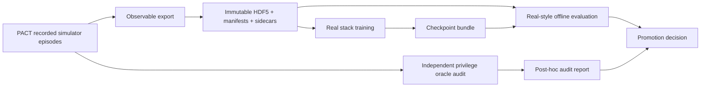

# V2.0.0 SimVerify：Conditioned Cycle ACT 真实部署口径离线验证计划

## 文档状态

| 项目 | 当前值 |
| --- | --- |
| 状态 | `draft_for_semantic_review` |
| 策略代码仓库 | `Excavator_real_stack` |
| Git 分支 | `v2.0.0-simVerify` |
| 基线标签 | `g49-n5-live-frozen-20260723` |
| 基线提交 | `a8c9eef0c86d80e96bff1d0649c07e76ceaedfed` |
| 仿真数据提供方 | `PACT/excavator_testbed` |
| 评测方式 | 真实部署代码路径上的 recorded-observation 离线 replay |
| 当前允许工作 | 数据契约、标注契约、离线评测设计、模型输入设计、文档评审 |
| 当前禁止工作 | 新增仿真 backend、运行仿真闭环、真机控制、正式训练、默认配置变更 |

本文是 conditioned-cycle 策略的唯一设计源。仿真仓库只负责产生数据和独立 oracle
审计，不再拥有策略训练、checkpoint、离线评测或部署语义。

## 1. 研究目标

第一阶段只回答一个问题：

> 使用未来真机可以获得的四路图像、qpos、qvel 和明确的 cycle condition，ACT
> 能否在已录制观测上产生任务顺序合理、动作有效、对目标有响应的连续两铲动作序列？

第一阶段最高只能证明：

- 模型能读取目标 condition；
- 相同观测下，更换 condition 会产生方向正确且可重复的动作差异；
- recorded-observation replay 中保留挖掘、运送、卸料和下一铲准备所需的动作阶段；
- 使用真实部署仓库的模型加载、图像预处理、temporal aggregation 和动作输出链路；
- checkpoint 可以被 real stack 的离线部署预检读取。

第一阶段不能证明：

- 模型已经在仿真闭环中完成两铲；
- 模型已经在真机完成两铲；
- 仿真动作幅值可以未经标定直接控制液压系统；
- 离线 replay 可以替代未来的 shadow 和真机短程验证。

## 2. 仓库责任边界

### 2.1 数据流



### 2.2 `PACT/excavator_testbed` 负责

- 读取仿真原始 episode；
- 导出不依赖 privilege 的观测数据；
- 导出数据来源、时间轴和字段 manifest；
- 在正式标注规则冻结后，独立运行 privilege oracle；
- 输出 oracle audit，不修改正式标签；
- 保留 Unity/AGX 在线 backend 和未来仿真闭环能力。

PACT 不负责：

- conditioned-cycle ACT 的训练实现；
- real stack checkpoint 格式；
- Jetson 推理优化；
- 真机 runtime；
- 本计划的主评测结论。

### 2.3 `Excavator_real_stack` 负责

- condition schema；
- 数据导入和训练 loader；
- 当前四相机 ACT 的 conditioned-cycle 扩展；
- 死区相关训练目标；
- recorded-observation replay；
- state-hold、延迟和相机反事实评测；
- checkpoint bundle、部署预检和数值精度验证；
- 未来 shadow、短程真机验证和正式部署。

### 2.4 禁止跨仓库隐式依赖

Real stack 不得：

- import PACT Python package；
- 启动 Unity、AGX 或 simulator backend；
- 在训练或主评测中读取 `env_state`；
- 通过相对路径直接读取另一个 Git 工作树里的配置；
- 假设 PACT camera、qpos 或 action 语义天然等同于真机。

跨仓库只允许通过有版本、哈希和 schema 的不可变数据包交换。

## 3. 策略任务定义

### 3.1 Cycle primitive

第一版学习一个完整 cycle：

```text
ready_i
  -> 在 current_sector_i 对应区域完成一铲
  -> 运送到固定卸料区并卸料
  -> 回转到 next_sector_i 上方
  -> ready_i+1
```

这比 `dig -> carry -> dump -> return` 四段 primitive 更连贯，同时避免一次训练十几铲造成
长时程误差累积。

### 3.2 初始目标空间

第一版只使用横向 3x1：

```text
left | center | right
```

不研究近、中、远，不继承仿真 planner 的 3x2 privileged terrain cell。

第一版 condition 草案为：

```text
cycle_condition_v1 =
  current_sector one-hot [3]
  + next_ready_sector one-hot [3]
```

总维度为 6。无效末尾 cycle 通过数据 mask 排除，不把 `next_valid` 作为模型输入。

相邻 cycle 必须满足：

```text
next_ready_sector(i) == current_sector(i+1)
```

### 3.3 Gohome 边界

`gohome` 继续由外部 PD/自动程序负责：

- 不进入 ACT 训练 action；
- 不作为 cycle condition；
- 不作为“模型完成回 home”的成功条件；
- 不用于补齐不完整 cycle。

指定 cycle 数量完成后，由外部监督器停止策略并决定是否调用 gohome。

## 4. Policy 可观察输入

候选 policy 只能读取：

- 四路相机；
- `qpos`；
- `qvel`；
- `cycle_condition_v1`。

不得读取：

- `env_state`；
- bucket mass；
- soil contact；
- removed-depth grid；
- 真实铲尖世界坐标；
- 精确土面高度；
- planner 私有状态；
- oracle 标注置信度；
- 未来帧或下一 cycle 的真实动作。

## 5. 数据交换契约

### 5.1 数据包结构

PACT 每次导出必须形成独立目录：

```text
sim_observable_cycle_export_v1/
  episodes/
    episode_*.hdf5
  dataset_manifest.json
  source_episode_manifest.json
  camera_mapping.json
  state_action_contract.json
  annotation_manifest.json
  cycle_annotations.jsonl
  split_groups.json
  checksums.sha256
  oracle_audit/
```

`oracle_audit/` 与正式训练输入物理分离。删除该目录后，训练和主评测结果必须保持不变。

### 5.2 相机契约

仿真源相机目前使用：

- `eye_left`
- `eye_right`
- `stick_up`
- `stick_down`

真实部署模型使用：

- `video4`
- `video5`
- `video6`
- `video7`

不得只按列表位置猜测映射。`camera_mapping.json` 必须记录：

```json
{
  "mapping_id": "pending",
  "source_to_policy": {},
  "policy_order": ["video4", "video5", "video6", "video7"],
  "roles": {
    "video4": "eye",
    "video5": "eye",
    "video6": "stick",
    "video7": "stick"
  },
  "source_resolution": {},
  "policy_resolution": {},
  "transform_id": "pending",
  "verification": {}
}
```

映射冻结前不得训练。需要用同步画面、机构位置和相机安装语义逐路确认。

### 5.3 qpos/qvel 契约

仿真数据中的归一化 qpos 不能直接当作真机弧度制 qpos。导出契约必须明确：

- 轴顺序；
- 单位；
- 正负方向；
- 零点；
- 有效范围；
- 是否做 unwrap；
- qvel 的时间单位；
- 越界处理；
- 模型最终消费的 canonical representation。

第一轮允许在仿真 source representation 上验证 condition 是否可学，但由此得到的
checkpoint 必须标记：

```text
sim_state_domain_only_not_real_deployable
```

只有 canonical qpos/qvel 映射完成并通过真实数据覆盖审计后，checkpoint 才能进入迁移评审。

### 5.4 Action 契约

仿真直接控制液压缸速度，不包含真机机械死区。第一轮不得用 raw action MAE 声称真实控制
可迁移。

必须记录：

- 四轴顺序；
- 正负方向；
- 数值范围；
- 单位或归一化方式；
- 动作是否经过平滑、裁剪或控制器变换；
- source action 与 real policy command 的关系；
- 哪些指标只比较方向和阶段，哪些指标允许比较幅值。

第一轮 checkpoint 的主要价值是验证：

- condition 响应；
- 动作阶段顺序；
- 有效方向覆盖；
- 两 cycle 连续性。

它不是未经标定即可上机的控制 checkpoint。

### 5.5 时间契约

仿真源数据为 50 Hz，当前真实部署目标为 20 Hz。第一轮默认导出因果 20 Hz 数据：

- 使用时间戳选择或聚合，不使用未来信息；
- 图像、qpos、qvel、action 和 condition 必须落在同一目标 tick；
- 不允许仅按固定帧号假设源数据严格无抖动；
- resample manifest 必须记录每个目标 tick 对应的源时间；
- action chunk 和 temporal aggregation 全部按 20 Hz 解释。

如果数据审计证明 20 Hz 转换破坏关键动作转折，必须先报告，再决定是否增加 50 Hz
研究对照；不能静默改变部署目标频率。

## 6. 标注契约

### 6.1 Command 与 outcome 分离

每个 cycle 必须分别记录：

- `command`：执行前明确提供给模型的目标；
- `outcome`：轨迹实际进入的扇区；
- `condition_source`：recorded command 或 hindsight outcome。

历史数据没有明确 command 时：

- command 保持 `unknown_not_recorded`；
- 可以用 outcome 做 hindsight relabel；
- 不得把 hindsight outcome 伪装成当时真实指令；
- 评测报告必须单独统计 recorded-command 和 hindsight-condition 数据。

### 6.2 可观察 cycle 边界

第一版需要从图像、qpos、qvel 和 action 定义：

- `ready_start`；
- `dig_entry_proxy`；
- `carry_transition_proxy`；
- `dump_start_proxy`；
- `dump_end_proxy`；
- `ready_end`。

这些是可观察任务阶段，不声称等于真实接触、真实载荷或土体移除事件。

### 6.3 标注 sidecar 草案

```json
{
  "schema_version": "observable_cycle_annotation_v1",
  "episode_id": 0,
  "cycle_id": 0,
  "source_steps": [0, 0],
  "target_steps_20hz": [0, 0],
  "command": {
    "current_sector": "unknown_not_recorded",
    "next_ready_sector": "unknown_not_recorded"
  },
  "outcome": {
    "actual_current_sector": "center",
    "actual_next_ready_sector": "left"
  },
  "condition_source": "hindsight_outcome",
  "observable_events": {
    "ready_start": 0,
    "dig_entry_proxy": 0,
    "carry_transition_proxy": 0,
    "dump_start_proxy": 0,
    "dump_end_proxy": 0,
    "ready_end": 0
  },
  "quality": {
    "status": "provisional",
    "reason_codes": [],
    "review_required": true
  }
}
```

### 6.4 Privilege oracle

Privilege oracle 只能在正式规则冻结后运行，并输出：

- observable event 与 privileged event 的偏差；
- outcome sector 一致率；
- 边界附近样本；
- 可观察标注的覆盖率；
- 失败原因分布。

Oracle 不得：

- 自动改写正式 sidecar；
- 决定 train/val/test split；
- 进入 policy observation；
- 进入可部署评测 gate；
- 用于挑选单个最好看的 checkpoint。

## 7. Real stack 需要新增的最小能力

本轮不移植 PACT ACT adapter。新增能力应建立在当前 real stack 四相机 ACT 上。

### 7.1 数据层

- 为 `cycle_condition_v1` 定义唯一 schema；
- loader 支持从 HDF5 或冻结 sidecar 读取 6 维 condition；
- normalization stats 记录 condition key、维度和 schema version；
- train/val/test 按完整 source episode 隔离；
- condition 缺失、维度错误或 schema 不匹配时 fail closed。

### 7.2 Policy 层

- `low_dim_keys` 增加明确的 `cycle_condition_v1`；
- state dimension 由配置和 schema 共同解析；
- `ACTAdapter.predict()` 要求 observation 中存在 condition；
- checkpoint bundle 记录 condition schema；
- 继续使用当前 camera role encoding；
- 继续使用当前四相机共享 backbone 批处理；
- 继续保留死区相关训练目标；
- 继续使用当前 temporal aggregation 和 latest-wins runtime 语义。

### 7.3 Eval 层

- 扩展现有 `testbed.cli.offline_policy_eval`，支持显式 condition 注入；
- 新增聚合任务事件评测；
- 新增 token counterfactual replay；
- 新增 state-hold replay；
- 新增延迟、跳帧和 stale-observation 离线诊断；
- 输出 raw policy action、aggregated action 和评测派生事件，三者不能混写。

### 7.4 Deployment 层

- deployment preflight 校验 condition schema；
- runtime condition 必须由显式外部指令提供；
- condition 改变必须写入日志；
- 缺失或非法 condition 时不得回退到上一次目标；
- 仿真专用字段不得出现在 bundle；
- 首轮 sim-domain checkpoint 必须阻止 real-control arming。

## 8. 对照组

| ID | 训练方式 | 用途 |
| --- | --- | --- |
| B0 | 同一数据、同一 ACT、不提供 condition | 判断任务本身是否能被 cycle ACT 学会 |
| B1 | `cycle_condition_v1` conditioned ACT | 主候选 |
| B2 | 与 B1 相同，但训练 condition 随机打乱 | 排除模型忽略 condition 时的伪改善 |
| B3 | 与 B1 相同，但评测时固定 center token | 检查输出差异是否真的来自目标 |
| R0 | 当前成功率最高的四相机单铲 real ACT | 结构、运行时和动作有效性的参考，不直接比较任务完成率 |

B0 与 B1 必须使用完全相同的：

- episode split；
- 相机输入；
- qpos/qvel；
- action；
- chunk size；
- seed；
- optimizer；
- epoch；
- sampling policy；
- checkpoint 选择规则。

## 9. 真实部署口径离线评测

所有主评测都运行在 `Excavator_real_stack`，读取已录制 HDF5，不启动任何 backend。

### E00：数据与 bundle 契约

检查：

- source SHA-256；
- export manifest；
- camera mapping；
- qpos/qvel/action contract；
- condition schema；
- split isolation；
- checkpoint config；
- dataset stats；
- 禁止字段扫描。

失败条件：

- 任一 policy 输入来自 privilege；
- camera 顺序不明确；
- condition schema 不一致；
- source episode 跨 split；
- checkpoint 不能被 real stack 严格加载。

### E01：完整 recorded-observation replay

按原始因果顺序输入：

- 四路图像；
- qpos/qvel；
- condition。

输出：

- raw ACT chunk；
- temporal aggregation 后动作；
- 每轴方向和有效区状态；
- observable task phase；
- condition；
- observation/action 时间戳。

这是 teacher-forced/open-loop 证据，不声明环境会按模型动作变化。

### E02：任务事件与顺序

根据预测动作提取可执行事件，例如：

- dig onset；
- bucket curl；
- carry transition；
- swing to dump；
- dump release；
- return swing；
- next-sector approach。

评测重点：

- 必要事件是否出现；
- 顺序是否合理；
- 是否缺少完整任务阶段；
- 是否出现长时间无效动作；
- 是否在错误方向持续输出。

不要求逐 tick 复制某一条专家动作。

### E03：Condition 反事实 replay

固定完全相同的 observation history，只替换：

- current sector；
- next ready sector。

需要测量：

- 首次可区分响应的延迟；
- swing 方向和目标的关系；
- 非目标轴扰动；
- task phase 是否保持；
- token 改变后输出是否稳定；
- 相同 token 重跑的一致性。

如果 token swap 几乎不改变输出，B1 不得被称为 conditioned policy。

### E04：相机反事实

分别运行：

- 四相机；
- eye pair only；
- stick pair only；
- 单路遮挡；
- pair 内交换；
- 跨角色交换；
- 固定帧或轻度时间错位。

评测：

- condition 响应是否保留；
- task phase 是否保留；
- 方向是否翻转；
- 是否依赖固定背景；
- camera role encoding 是否真的被使用。

### E05：State-hold replay

从已记录 anchor 开始重复同一组观测若干 tick，同时保持 condition 不变。

它只回答：

> 当观测暂时没有变化时，策略内部状态和 temporal aggregation 会怎样演化？

它不模拟：

- 液压；
- 土体；
- 机构惯性；
- 接触；
- 真实 qpos 响应。

指标：

- active 保持时间；
- 方向翻转；
- 意外新增轴；
- deadzone 内衰减；
- temporal aggregation population；
- state snapshot 恢复一致性。

### E06：延迟、跳帧与 latest-wins

离线模拟：

- 推理低于 20 Hz；
- 跳过 observation tick；
- observation age 增长；
- latest-wins 丢弃旧 chunk；
- control loop 重复最近动作；
- 超时后归零。

模型输入仍来自已记录 observation，不生成新的物理状态。

评测：

- stale action age；
- 控制延迟累积；
- 任务事件错序；
- 有效方向变化；
- 超时保护是否生效；
- 结果是否符合当前现场 runtime 语义。

### E07：两 cycle recorded-path replay

选择包含完整：

```text
ready_i -> cycle_i -> ready_i+1 -> cycle_i+1 -> ready_i+2
```

的已记录片段。

评测：

- cycle_i 是否完成必要动作阶段；
- next_ready_sector_i 是否影响 return 段；
- ready_i+1 附近是否出现断裂或平均动作；
- cycle_i+1 是否能按新 current condition 重新启动；
- 两 cycle 是否存在语义串扰。

不能把 replay 结尾仍有动作解释成闭环多挖了一铲。

### E08：数值精度与推理性能

使用 real stack 当前基准工具和同一录制 observation 比较：

- reference FP32；
- compiled FP32；
- 其他候选精度只在明确提出后测试。

至少输出：

- P50/P95/P99 latency；
- raw chunk 最大误差；
- executed action 最大误差；
- deadzone/effective class disagreement；
- task event disagreement；
- condition-response disagreement。

只有性能提升且任务语义等价时，优化才可进入部署候选。

### E09：Real-transfer contract audit

不运行真机控制，只比较 sim export 与真实数据的：

- camera role、分辨率和视野；
- qpos/qvel 范围；
- action 方向和幅值；
- episode phase；
- condition 覆盖；
- input normalization。

该评测决定 checkpoint 是：

- `sim_observable_only`；
- `real_finetune_candidate`；
- `shadow_candidate`；
- `control_candidate`。

不得跨级提升。

## 10. 指标

### 10.1 任务动作

- `required_event_coverage`
- `event_order_violation_rate`
- `missing_phase_rate`
- `opposite_direction_rate`
- `unexpected_effective_axis_rate`
- `deadzone_effective_recall`
- `two_cycle_phase_coverage`
- `ready_boundary_discontinuity`

### 10.2 指令服从

- `token_swap_action_effect`
- `token_swap_direction_accuracy`
- `token_response_latency_ticks`
- `same_token_repeat_consistency`
- `current_sector_sensitivity`
- `next_sector_sensitivity`
- `condition_ignored_rate`

### 10.3 鲁棒性

- `eye_only_retention`
- `stick_only_retention`
- `single_camera_dropout_retention`
- `pair_swap_failure_rate`
- `cross_role_swap_failure_rate`
- `state_hold_direction_flip_rate`
- `delay_event_order_violation_rate`

### 10.4 轨迹相似性

- action MAE；
- direction agreement；
- event-time difference；
- active-duration difference。

MAE 只作为辅助指标。模型可以采用与某条专家不同但任务合理的动作细节。

## 11. 数据分组

数据至少按完整 source episode 分成：

- train；
- validation；
- held-out test；
- condition counterfactual anchors；
- state-hold anchors；
- two-cycle continuity set；
- real-transfer audit set。

同一个 source episode 的 cycle、相邻帧和派生 sidecar 不得跨 split。

评测必须报告：

- 数据源数量；
- 每个 sector 数量；
- sector transition 数量；
- 两 cycle pair 数量；
- 不同 camera/terrain/起始姿态覆盖；
- recorded command 与 hindsight condition 比例。

## 12. Gate 与终止条件

### G0：仓库和输入边界

- 策略实现只存在于 real stack；
- PACT 仅输出不可变数据包和 oracle audit；
- 主评测在没有 PACT checkout、Unity 和 AGX 时也能运行；
- policy 输入扫描不存在 privilege。

### G1：数据契约

- 相机映射冻结；
- qpos/qvel/action/time contract 冻结；
- 20 Hz 导出可复现；
- source SHA 和 export SHA 完整；
- episode split 无泄漏。

### G2：标注可用

- cycle 边界规则可复算；
- 不确定样本进入 review 或排除；
- command/outcome 不混写；
- held-out oracle audit 达到评审后冻结的门槛。

### G3：Unconditioned cycle baseline

B0 必须先证明当前 observation 能表达完整 cycle 的主要动作阶段。若 B0 无法形成任务动作，
不得把 B1 的失败归因于 condition 设计。

### G4：Condition 响应

B1 相对 B0/B2 必须：

- 在 token swap 下产生稳定差异；
- 差异方向与目标一致；
- 不通过破坏整个任务阶段制造差异；
- 不显著增加反向和意外有效轴。

### G5：两 cycle 连续性

- 两个 cycle 的必要事件均出现；
- ready 边界无持续失控动作；
- 第二 cycle 能按新 condition 启动；
- 不依赖单条轨迹得出结论。

### G6：运行时等价

- compiled FP32 相对 reference 的任务语义等价；
- 延迟和 latest-wins 评测通过；
- bundle preflight 通过；
- sim-domain checkpoint 保持 real-control 禁用。

### 停止条件

出现以下情况时停止扩大训练：

- condition 在 held-out counterfactual 上不可辨识；
- 自动标注无法稳定复算；
- qpos/action 域差异无法建立明确契约；
- 两 cycle 数据覆盖不足；
- 模型只在训练来源或固定背景上响应；
- 性能优化改变任务事件或有效方向；
- 评测需要读取 privilege 才能给出结论。

## 13. Hard Rules

### HR-01：Single Policy Source

Conditioned-cycle policy、训练、checkpoint 和部署语义只在
`Excavator_real_stack` 维护。

### HR-02：No Simulator Runtime Dependency

Real stack 的训练和主评测不得 import、启动或连接 simulator backend。

### HR-03：Recorded-Observation Only

主评测只消费已记录 observation。不得伪造 policy action 之后的 qpos、图像或土体状态。

### HR-04：Privilege Isolation

Privilege oracle 必须独立运行。删除 oracle 产物后训练和主评测结果必须不变。

### HR-05：Command / Outcome Separation

未记录的 command 永远保持 unknown；hindsight outcome 必须显式标记来源。

### HR-06：Immutable Source Data

源 HDF5 只读。裁剪、重采样、标注和 condition 通过新数据集或 sidecar 产生。

### HR-07：Canonical Input Contract

相机、qpos、qvel、action、频率和 condition 必须有唯一版本化定义。

### HR-08：Runtime-Equivalent 20 Hz

训练 chunk、离线 replay、temporal aggregation 和延迟评测默认按真实目标 20 Hz 解释。

### HR-09：Episode-Level Isolation

同一 source episode 的任何派生数据不得跨 split。

### HR-10：No Single-Trajectory Verdict

单条成功或失败轨迹只能用于诊断，不能决定模型整体能力。

### HR-11：MAE Is Secondary

总 MAE 不能覆盖任务事件、方向安全、有效动作和 condition 响应指标。

### HR-12：Test Intent Registration

每个新评测必须记录：

- 要回答的问题；
- 可观察输入；
- 干预变量；
- 指标；
- 能证明什么；
- 不能证明什么；
- 终止条件。

### HR-13：Raw Action Preservation

必须分别保存 raw chunk、temporal aggregation 后动作和未来 runtime-safe action。

### HR-14：One-Factor Experiment

结构、数据、loss、condition 或 runtime 的因果实验一次只改变一个主要因素。

### HR-15：Predeclared Stop

训练前写明 epoch、checkpoint 选择、主指标和停止条件，不能看完结果再改成功口径。

### HR-16：Artifact Provenance

每次 run 必须记录 Git SHA、dirty 状态、dataset SHA、split、camera mapping、condition schema、
resolved config、seed 和 checkpoint SHA。

### HR-17：Checkpoint Contract

Condition 维度、输入顺序、camera role、state domain 和 action domain 必须进入 bundle manifest。

### HR-18：No Automatic Deployment Promotion

通过 SimVerify 不等于可上机。必须单独经过 real-transfer audit、shadow 和短程控制 gate。

### HR-19：Gohome Outside ACT

Gohome 不进入 cycle ACT 模仿目标，不用于伪造完整 cycle。

### HR-20：Numerical Equivalence Before Speedup

任何推理加速都必须同时报告动作数值差异、有效区分类差异和任务事件差异。

## 14. Git 与产物管理

### 14.1 分支

当前分支从现场验证标签建立：

```text
g49-n5-live-frozen-20260723
  -> v2.0.0-simVerify
```

旧 PACT `v2.0.0-simVerify` 分支属于错误仓库和错误基线，迁移完成后删除。

早期探索保留在：

```text
codex/simverify-early-exploration-archive
```

该归档只能选择性参考，不得整分支合并。

### 14.2 建议提交顺序

```text
docs: move simverify research plan to real stack
test: define cycle condition and import contracts
feat(data): ingest observable cycle exports
feat(eval): add real-style conditioned offline replay
feat(policy): add cycle_condition_v1 input
exp: train unconditioned cycle baseline
exp: train conditioned cycle candidate
docs: record evidence and promotion decision
```

### 14.3 外部产物

建议目录：

```text
/data/pingfan/Excavator_real_stack_data/sim_observable_cycle_v1/
/data/pingfan/Excavator_real_stack_runs/simverify_cycle_v1/
```

每次 run 至少包含：

```text
run_metadata.json
resolved_config.yaml
dataset_manifest.json
source_episode_manifest.json
camera_mapping.json
state_action_contract.json
annotation_manifest.json
train_val_test_split.yaml
checkpoint_manifest.json
offline_eval/
decision.json
```

数据、checkpoint、逐步 NPZ/CSV 和大图不进入 Git。

## 15. 实施阶段

### M0：冻结跨仓库数据契约

只做审计和文档：

- 相机映射；
- qpos/qvel/action；
- 50 Hz 到 20 Hz；
- condition schema；
- cycle 标注；
- export manifest。

### M1：Real stack 导入 smoke

- 读取 1 至 2 个导出 episode；
- 不修改 ACT；
- 验证四相机、qpos/qvel、action、condition 对齐；
- 验证在无 PACT checkout 时可运行。

### M2：离线评测骨架

- condition-aware offline replay；
- test-intent registry；
- task event extractor；
- token swap；
- state-hold；
- delay/latest-wins；
- 输出 provenance。

### M3：Unconditioned baseline

- 同一 cycle 数据；
- 当前四相机 ACT；
- 不提供 condition；
- 先判断完整 cycle 是否可学。

### M4：Conditioned candidate

- 增加 `cycle_condition_v1`；
- 其他训练因素保持不变；
- 运行 B0/B1/B2 对照；
- 只做离线评测。

### M5：迁移决策

根据 G0 至 G6 将结果标记为：

- `reject`;
- `revise_annotation`;
- `revise_condition`;
- `sim_observable_only`;
- `real_finetune_candidate`.

本阶段不产生 `control_candidate`。

## 16. 实施前待确认

1. 四路仿真相机到 `video4` 至 `video7` 的准确映射是什么？
2. V2 模型使用哪一种 canonical qpos/qvel representation？
3. 仿真 action 如何映射到真实 policy command 的方向和幅值语义？
4. 50 Hz 转 20 Hz 是否保留所有关键动作转折？
5. `ready_start` 和 `ready_end` 的可观察规则是什么？
6. 两 cycle pair 的实际数量和 3x1 transition 覆盖是多少？
7. 第一轮是否只用 hindsight condition，还是存在 recorded command？
8. condition one-hot 是否需要单独 embedding，而不是直接拼接到 proprio？
9. B0 的完整 cycle 数据长度是否超过当前 ACT 可稳定建模范围？
10. 哪些指标作为 G3/G4/G5 的冻结数值门槛？

这些问题确认前不修改训练代码，不启动正式训练。
