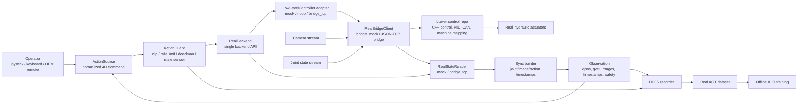

# Excavator Testbed

Python-side real-excavator data and policy testbed. This branch is real-only:
the old offline environment backend, replay loop, and closed-loop command stack
have been removed. The remaining project is intentionally small,
hot-pluggable, and adapter-oriented.

## System Concept



Current module roles:

- `testbed/backends/base.py`: stable backend interface used by recorder and
  future policy runners.
- `testbed/backends/real/`: `RealBackend`, mock/noop controllers, state
  readers, shared bridge-client adapters, packet adapters, timestamp sync
  helpers, and optional ROS/CAN stubs.
- `testbed/actions/`: joystick, keyboard, OEM remote boundary, and zero-action
  teleop sources.
- `testbed/data/`: HDF5 writer/reader, recorder, dataset loader, QC, videos.
- `testbed/policies/`: ACT and policy adapters for offline training.
- `testbed/runtime/`: safety guard, training helper, run metadata.

The lower excavator planning/control repo should own CAN, ROS nodes or bridge
processes, PID, hydraulic/motor mapping, hardware status, and machine safety
details. This testbed owns data collection, policy training, recording
metadata, and adapter-level contracts.

## Real Contract

```text
action order = [swing, boom, stick, bucket]
qpos         = calibrated joint angle, rad
qvel         = joint velocity, rad/s
action       = normalized operator/control command in [-1, 1]
```

HDF5 episodes use:

- `/observations/qpos`: `(T, 4)` float32
- `/observations/qvel`: `(T, 4)` float32
- `/observations/images/fpv`: `(T, H, W, 3)` uint8 RGB
- `/action`: `(T, 4)` guard-filtered normalized action
- `/diagnostics/*`: raw action, guard reason, controller ack/fault/timestamp,
  commanded action, action sample/send timestamps, joint/image timestamps, and
  sync skew
- metadata: `is_real=true`, `platform=real_excavator`, units, axis order,
  learning target, sync/video hints, and recording config snapshot

## Learning Target

The first-stage imitation-learning target is:

```text
observation_t -> operator command_t
```

That means the dataset should record what the human intended to command at the
same observation time, not only the machine motion that appears after hydraulic
delay. Joystick and keyboard already expose this command directly. If the
manufacturer remote is used for demonstrations, we need a reader for the
remote command stream; `testbed.actions.oem_remote.OemRemoteActionSource`
is the import-safe adapter boundary for that future reader.

Directly learning joint motion is possible, but it is a harder first target:
the policy must absorb human intent, controller response, hydraulic lag, and
mechanical delay in one model. A better first loop is to learn normalized
operator commands, record joint response alongside them, and let the lower
control stack convert commands into hydraulic/CAN actuation.

ACT can learn some repeatable delay in the data, but it should not be the only
place where hydraulic behavior is handled. The lower control repo should own
the real command-to-hydraulic conversion and safety-critical limits. The
testbed should record enough signals to debug the delay: raw operator command,
guarded command, command send time, joint state time, image time, status, and
controller acknowledgement time.

## Sync And Video Requirements

Joint state and camera frames must carry timestamps from the sensor or ROS
message header. The recorder stores:

- `action_sample_timestamp_ns`: when the teleop command was sampled.
- `action_send_timestamp_ns`: when the command was sent to the backend.
- `joint_timestamp_ns`: timestamp of the qpos/qvel sample.
- `image_timestamp_ns`: timestamp of the primary camera frame.
- `sync_timestamp_ns` and `sync_max_skew_ns`: observation alignment summary.

`testbed.backends.real.sync` provides a pure-Python
`SynchronizedObservationBuilder` and `TimestampedBuffer` so the timestamp
policy can be tested without ROS, CAN, or hardware.

For operator experience, the camera path should be treated as a low-latency
control stream rather than a high-quality logging stream. The target config
currently records `video.target_latency_ms=120`. Hardware integration should
prefer camera-side timestamps, small queues, latest-frame consumption, and a
low-latency transport. HDF5 can still store the final aligned RGB frame after
the operator loop consumes it.

## Lower Control Repo Status

The lower `excavator` repo has usable core pieces for real control:

- C++ command/status API types such as speed-scalar commands and snapshots.
- Control modes, PID/control logic, motor/RPM conversion, and safety/status
  plumbing.
- CAN loop code and a TCP packet demo shape compatible with this testbed's
  `excavator_api` packet adapter.

What still requires target-machine or hardware validation:

- A production ROS/CAN bridge node and final low-latency camera path.
- The C++ JSON/TCP bridge against real SocketCAN rather than simulation.
- Real qpos/qvel/status units, signs, timestamps, and fault semantics.
- OEM remote command decoding.
- End-to-end hardware timing validation.

The monorepo now includes a first C++ JSON/TCP bridge process under `bridge/`
for smoke testing the shared `bridge_tcp` protocol against the lower C++ API.
It defaults to simulation and real CAN disabled; it is not the final ROS/camera
integration.

## Bridge Contract

`RealBackend` is intentionally split into three plug points:

```text
LowLevelController.send(action4, state) -> ControlResult
RealStateReader.read(step_id, action_timestamp_ns) -> RealStateSamples
SynchronizedObservationBuilder.build(joint_sample, image_samples) -> observation
```

For integrations where command and state should come from the same external
process, both adapters can share one `RealBridgeClient`:

```text
BridgeLowLevelController -> RealBridgeClient <- BridgeStateReader
```

Any external bridge, including the current C++ JSON/TCP bridge and a future
ROS/CAN bridge, should satisfy these fields:

- Command input: normalized 4D action, action send timestamp, optional current
  state snapshot.
- Command result: ack, fault code, controller timestamp, commanded action, and
  optional raw lower-level command.
- Joint/status output: qpos, qvel, status, joint timestamp.
- Camera output: image frame, camera timestamp, receive timestamp.
- Optional operator stream: OEM remote action and action timestamp.

`MockStateReader` and `MockLowLevelController` exercise the same public
interfaces without requiring ROS, CAN, or hardware. `bridge_mock` exercises the
same shared-client topology used by `bridge_tcp`.

### JSON/TCP Bridge

`JsonTcpBridgeClient` is a development protocol for an external bridge process.
It uses newline-delimited JSON frames:

```text
send_action.request  -> send_action.response
read_state.request   -> read_state.response
reset.request        -> reset.response
close.request        -> close.response
shutdown.request     -> shutdown.response
```

The `send_action` payload carries normalized 4D action and a compact state
summary. The response carries `ControlResult`. The `read_state` response
carries timestamped joint/status samples and timestamped camera samples.

This JSON/TCP path is meant for integration testing and bridge bring-up. It is
not the final low-latency video path; the video stream should still use a
camera-appropriate transport when the hardware system is assembled.

## Current Commands

```bash
tb-record-real \
  --config testbed/configs/teleop_real_v1.yaml \
  --backend bridge_mock \
  --state-reader bridge_mock \
  --input zero \
  --num-episodes 1

tb-dataset-qc --dataset-dir data/real_teleop_v1

tb-dataset-videos data/real_teleop_v1/

tb-train --config testbed/configs/act_real_v1.yaml
```

`mock` lets the full HDF5/QC/training path run without hardware. `bridge_mock`
uses a shared in-process bridge client for command and state. `noop` accepts
valid actions but commands zeros. Hardware integrations should arrive as bridge
adapters or external bridge processes without requiring ROS/CAN to import the
whole package.

For a local external bridge process, use:

```bash
tb-bridge-mock-server --host 127.0.0.1 --port 8765

tb-record-real \
  --config testbed/configs/teleop_real_v1.yaml \
  --backend bridge_tcp \
  --state-reader bridge_tcp \
  --bridge-host 127.0.0.1 \
  --bridge-port 8765
```

`bridge_tcp` can use either the YAML fields under `real.bridge` or the CLI
overrides above. The same server can also be launched as
`python3 tools/bridge_mock_server.py --port 8765` when console scripts are not
installed.

For the C++ bridge, build `bridge/excavator_real_bridge` from the repository
root and point the same `bridge_tcp` command at its host/port. Keep
`--can-bus-enabled false --can-simulation true --imu-simulation true` for the
first smoke test.

The repository-level smoke script wraps this path:

```bash
scripts/smoke_real_bridge.sh
```

## Adapter Boundary

`testbed.backends.real.contracts` is pure Python and has no ROS/CAN dependency.
It maps the testbed 4D action into the lower repo's 8-axis speed-scalar command:

```text
[swing, boom, stick, bucket] ->
[swing, boom, stick, bucket, left_track, right_track, boom_offset, chassis_dozer]
```

The last four axes are zero in this first-stage fixed-workcell dataset path.
`testbed.backends.real.excavator_api` can produce packet bytes compatible with
the lower repo TCP demo protocol, and `testbed.backends.real.ros_can` is an
import-safe stub for future ROS/CAN work.

## Safety Posture

The recorder never assumes software can reset the real machine. Episode start
and stop are operator/CLI controlled. `ActionGuard` clips commands, rate-limits
per-step changes, and forces zero action on deadman release, e-stop, manual
override, stale sensor state, or sensor timeout.

This repository should not execute hardware-facing commands by default. In
non-hardware environments, use `mock`, `noop`, static checks, and adapter unit
tests.
